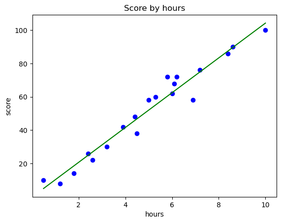
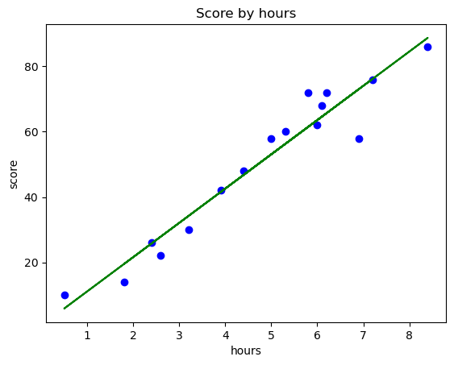
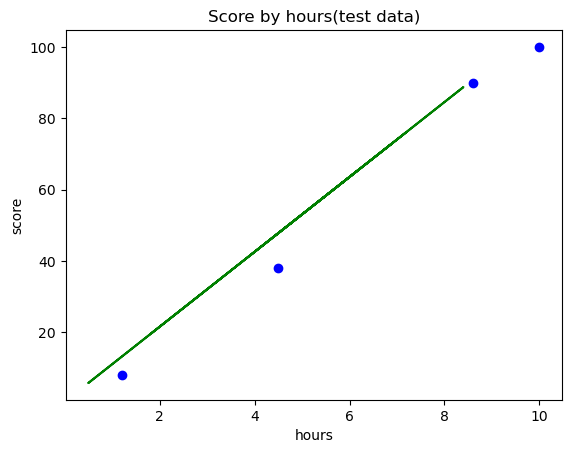
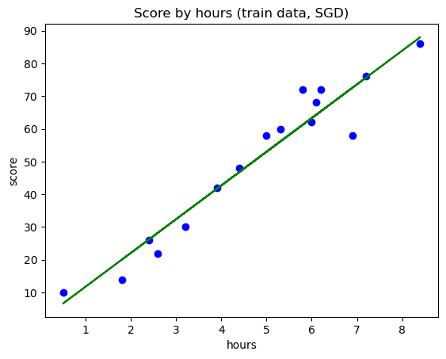

# 1. Linear Regression
### 공부시간에 따른 시험 점수


```python
import matplotlib.pyplot as plt
import pandas as pd
```


```python
dataset = pd.read_csv('LinearRegressionData.csv')
```


```python
dataset.head()
```


<div>
<style scoped>
    .dataframe tbody tr th:only-of-type {
        vertical-align: middle;
    }

    .dataframe tbody tr th {
        vertical-align: top;
    }

    .dataframe thead th {
        text-align: right;
    }
</style>
<table border="1" class="dataframe">
  <thead>
    <tr style="text-align: right;">
      <th></th>
      <th>hour</th>
      <th>score</th>
    </tr>
  </thead>
  <tbody>
    <tr>
      <th>0</th>
      <td>0.5</td>
      <td>10</td>
    </tr>
    <tr>
      <th>1</th>
      <td>1.2</td>
      <td>8</td>
    </tr>
    <tr>
      <th>2</th>
      <td>1.8</td>
      <td>14</td>
    </tr>
    <tr>
      <th>3</th>
      <td>2.4</td>
      <td>26</td>
    </tr>
    <tr>
      <th>4</th>
      <td>2.6</td>
      <td>22</td>
    </tr>
  </tbody>
</table>
</div>


```python
X = dataset.iloc[:, :-1].values # 처음부터 마지막 컬럼 직전까지 데이터[독립변수]
Y = dataset.iloc[:,-1].values #마지막 컬럼 데이터[종속 변수 - 결과]
```


```python
# dataset.iloc??
```


```python
X, Y
```


    (array([[ 0.5],
            [ 1.2],
            [ 1.8],
            [ 2.4],
            [ 2.6],
            [ 3.2],
            [ 3.9],
            [ 4.4],
            [ 4.5],
            [ 5. ],
            [ 5.3],
            [ 5.8],
            [ 6. ],
            [ 6.1],
            [ 6.2],
            [ 6.9],
            [ 7.2],
            [ 8.4],
            [ 8.6],
            [10. ]]),
     array([ 10,   8,  14,  26,  22,  30,  42,  48,  38,  58,  60,  72,  62,
             68,  72,  58,  76,  86,  90, 100]))


```python
from sklearn.linear_model import LinearRegression
reg = LinearRegression() #객체 생성
reg.fit(X, Y)
y_pred = reg.predict(X) #X에 대한 예측값
```


```python
y_pred
```


    array([  5.00336377,  12.31395163,  18.58016979,  24.84638795,
            26.93512734,  33.20134551,  40.51193337,  45.73378184,
            46.77815153,  52.        ,  55.13310908,  60.35495755,
            62.44369694,  63.48806663,  64.53243633,  71.84302419,
            74.97613327,  87.5085696 ,  89.59730899, 104.2184847 ])


```python
plt.scatter(X, Y, color='blue') # 산점도
plt.plot(X, y_pred, color='green') # 선 그래프
plt.title('Score by hours') #제목
plt.xlabel('hours') # x축 이름
plt.ylabel('score') # y축 이름
plt.show()
```


    

    


```python
print("9시간 공부했을 때 예상 점수 : {}".format(reg.predict([[100],[9]])))
```

    9시간 공부했을 때 예상 점수 : [1044.15120935   93.77478776]


```python
reg.coef_ # 기울기 (m)
```


    array([10.44369694])


```python
reg.intercept_ # y 절편[b]
```


    -0.218484702867201


```python
10.44369694 * 9 + -0.218484702867201 #y = mx + b
```


    93.7747877571328


### 데이터 세트 분리


```python
import matplotlib.pyplot as plt
import pandas as pd
```


```python
dataset = pd.read_csv('LinearRegressionData.csv')
dataset
```


<div>
<style scoped>
    .dataframe tbody tr th:only-of-type {
        vertical-align: middle;
    }

    .dataframe tbody tr th {
        vertical-align: top;
    }

    .dataframe thead th {
        text-align: right;
    }
</style>
<table border="1" class="dataframe">
  <thead>
    <tr style="text-align: right;">
      <th></th>
      <th>hour</th>
      <th>score</th>
    </tr>
  </thead>
  <tbody>
    <tr>
      <th>0</th>
      <td>0.5</td>
      <td>10</td>
    </tr>
    <tr>
      <th>1</th>
      <td>1.2</td>
      <td>8</td>
    </tr>
    <tr>
      <th>2</th>
      <td>1.8</td>
      <td>14</td>
    </tr>
    <tr>
      <th>3</th>
      <td>2.4</td>
      <td>26</td>
    </tr>
    <tr>
      <th>4</th>
      <td>2.6</td>
      <td>22</td>
    </tr>
    <tr>
      <th>5</th>
      <td>3.2</td>
      <td>30</td>
    </tr>
    <tr>
      <th>6</th>
      <td>3.9</td>
      <td>42</td>
    </tr>
    <tr>
      <th>7</th>
      <td>4.4</td>
      <td>48</td>
    </tr>
    <tr>
      <th>8</th>
      <td>4.5</td>
      <td>38</td>
    </tr>
    <tr>
      <th>9</th>
      <td>5.0</td>
      <td>58</td>
    </tr>
    <tr>
      <th>10</th>
      <td>5.3</td>
      <td>60</td>
    </tr>
    <tr>
      <th>11</th>
      <td>5.8</td>
      <td>72</td>
    </tr>
    <tr>
      <th>12</th>
      <td>6.0</td>
      <td>62</td>
    </tr>
    <tr>
      <th>13</th>
      <td>6.1</td>
      <td>68</td>
    </tr>
    <tr>
      <th>14</th>
      <td>6.2</td>
      <td>72</td>
    </tr>
    <tr>
      <th>15</th>
      <td>6.9</td>
      <td>58</td>
    </tr>
    <tr>
      <th>16</th>
      <td>7.2</td>
      <td>76</td>
    </tr>
    <tr>
      <th>17</th>
      <td>8.4</td>
      <td>86</td>
    </tr>
    <tr>
      <th>18</th>
      <td>8.6</td>
      <td>90</td>
    </tr>
    <tr>
      <th>19</th>
      <td>10.0</td>
      <td>100</td>
    </tr>
  </tbody>
</table>
</div>


```python
X = dataset.iloc[:, :-1].values
Y = dataset.iloc[:, -1].values
X, Y
```


    (array([[ 0.5],
            [ 1.2],
            [ 1.8],
            [ 2.4],
            [ 2.6],
            [ 3.2],
            [ 3.9],
            [ 4.4],
            [ 4.5],
            [ 5. ],
            [ 5.3],
            [ 5.8],
            [ 6. ],
            [ 6.1],
            [ 6.2],
            [ 6.9],
            [ 7.2],
            [ 8.4],
            [ 8.6],
            [10. ]]),
     array([ 10,   8,  14,  26,  22,  30,  42,  48,  38,  58,  60,  72,  62,
             68,  72,  58,  76,  86,  90, 100]))


```python
from sklearn.model_selection import train_test_split #튜플 형태로 값이 4개가 나눠짐

X_train, X_test , Y_train, Y_test = train_test_split(X, Y, test_size=0.2, random_state=0) #훈련세트를 8:2로 분리
```


```python
X, len(X) #전체 데이터 X, 개수
```


    (array([[ 0.5],
            [ 1.2],
            [ 1.8],
            [ 2.4],
            [ 2.6],
            [ 3.2],
            [ 3.9],
            [ 4.4],
            [ 4.5],
            [ 5. ],
            [ 5.3],
            [ 5.8],
            [ 6. ],
            [ 6.1],
            [ 6.2],
            [ 6.9],
            [ 7.2],
            [ 8.4],
            [ 8.6],
            [10. ]]),
     20)


```python
X_train, len(X_train), Y_train, len(Y_train)
```


    (array([[5.3],
            [8.4],
            [3.9],
            [6.1],
            [2.6],
            [1.8],
            [3.2],
            [6.2],
            [5. ],
            [4.4],
            [7.2],
            [5.8],
            [2.4],
            [0.5],
            [6.9],
            [6. ]]),
     16,
     array([60, 86, 42, 68, 22, 14, 30, 72, 58, 48, 76, 72, 26, 10, 58, 62]),
     16)


```python
X_test, len(X_test), Y_test, len(Y_test)
```


    (array([[ 8.6],
            [ 1.2],
            [10. ],
            [ 4.5]]),
     4,
     array([ 90,   8, 100,  38]),
     4)


### 분리된 데이터를 통한 모델링


```python
from sklearn.linear_model import LinearRegression
reg = LinearRegression()
reg.fit(X_train, Y_train) #훈련 세트로 학습
X_train
```


    array([[5.3],
           [8.4],
           [3.9],
           [6.1],
           [2.6],
           [1.8],
           [3.2],
           [6.2],
           [5. ],
           [4.4],
           [7.2],
           [5.8],
           [2.4],
           [0.5],
           [6.9],
           [6. ]])


### 데이터 시각화


```python
plt.scatter(X_train, Y_train, color="blue")
plt.plot(X_train, reg.predict(X_train), color="green")
plt.title("Score by hours")
plt.xlabel("hours")
plt.ylabel("score")
plt.show()
```


    

    


```python
reg.coef_, reg.intercept_
```


    (array([10.49161294]), 0.6115562905169796)


### 데이터 시각화(테스트 세트)


```python
plt.scatter(X_test, Y_test, color="blue")
plt.plot(X_train, reg.predict(X_train), color="green")
plt.title("Score by hours(test data)")
plt.xlabel("hours")
plt.ylabel("score")
plt.show()
```


    

    


```python
reg.coef_
```


    array([10.49161294])


```python
reg.intercept_
```


    0.6115562905169796


```python
reg.predict([[9]]), round((10.49161294 * 9 + 0.6115562905169796), 9)
```


    (array([95.03607273]), 95.036072751)


### 모델 평가


```python
reg.score(X_test, Y_test) # 테스트 세트를 통한 모델 평가
```


    0.9727616474310156


```python
reg.score(X_train, Y_train) # 훈련 세트를 통한 모델 평가
```


    0.9356663661221668


### 경사 하강법(Gradient Descent)

max_iter : 훈련 세트 반복 횟수(Epoch 횟수)
eta0 : 학습률(learning rate)


```python
from sklearn.linear_model import SGDRegressor # SGD : Stochastic Gradient Descent 확률적 경사 하강법
#지수표기법
# 1e-3 : 0.001(10^-3)
# 1e-4 : 0.0001(10^-4)
# 1e+3 : 1000(10^3)
# 1e+4 : 10000(10^4)

# sr = SGDRegressor(max_iter=1000, eta0=1e-4, random_state=0, verbose=1)
sr = SGDRegressor()
sr.fit(X_train, Y_train)

plt.scatter(X_train, Y_train, color="blue")
plt.plot(X_train, sr.predict(X_train), color="green")
plt.title("Score by hours (train data, SGD)")
plt.xlabel("hours")
plt.ylabel("score")
plt.show()
```


    

    


```python
sr.coef_, sr.intercept_
```


    (array([10.293905]), array([1.50531186]))


```python
sr.score(X_test, Y_test) # 테스트 세트를 통한 모델 평가
```


    0.9734945664287501


```python
sr.score(X_train, Y_train) # 훈련 세트를 통한 모델 평가
```


    0.9353307805772852


