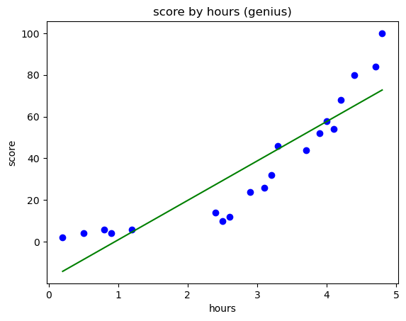
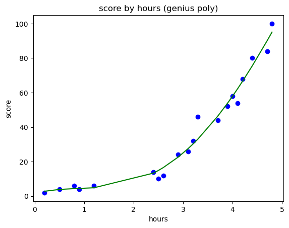
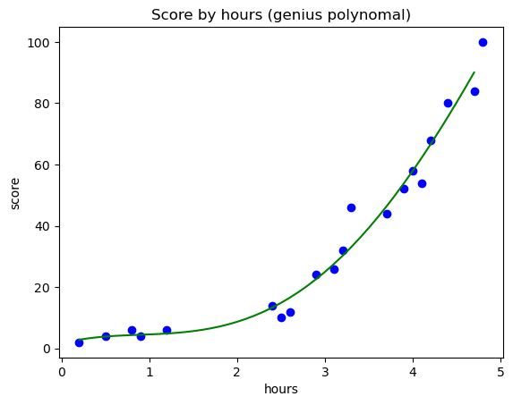

# 3. Polynomial Regression

### 공부 시간에 따른 시험 점수(우등생)


```python
import pandas as pd
import matplotlib.pyplot as plt
import numpy as np

dataset = pd.read_csv('PolynomialRegressionData.csv')
x = dataset.iloc[:,:-1].values
y = dataset.iloc[:,-1].values
x, y
```


    (array([[0.2],
            [0.5],
            [0.8],
            [0.9],
            [1.2],
            [2.4],
            [2.5],
            [2.6],
            [2.9],
            [3.1],
            [3.2],
            [3.3],
            [3.7],
            [3.9],
            [4. ],
            [4.1],
            [4.2],
            [4.4],
            [4.7],
            [4.8]]),
     array([  2,   4,   6,   4,   6,  14,  10,  12,  24,  26,  32,  46,  44,
             52,  58,  54,  68,  80,  84, 100]))


### 3-1. 단순 선형 회귀(Simple Linear Regression)


```python
from sklearn.linear_model import LinearRegression
reg = LinearRegression()
reg.fit(x, y) #전체 데이터 학습
reg.coef_, reg.intercept_
```


    (array([18.90403463]), -17.954579374160488)


### 데이터 시각화(전체)


```python
plt.scatter(x, y, color="blue")
plt.plot(x, reg.predict(x), color="green")
plt.title("score by hours (genius)") 
plt.xlabel("hours")
plt.ylabel("score")
plt.show()
```


    

    


```python
reg.score(x, y) #전체 데이터 점수
```


    0.8169296513411765


### 3-2. 다항 회귀(Polynomial Regression)


```python
from sklearn.preprocessing import PolynomialFeatures
poly_reg = PolynomialFeatures(degree=4) #4차
# poly_reg.fit(x) # 새롭게 만들 피처들의 조합을 찾는 역할 
# poly_reg.transform(x) # 실제로 데이터를 변환하는 작업
x_poly = poly_reg.fit_transform(x) #fit()과 transform() 두가지를 같이 해줌.
x_poly[:5]
# 인덱스[0] x^0
# 인덱스[1] x^1
# 인덱스[2] x^2
```


    array([[1.0000e+00, 2.0000e-01, 4.0000e-02, 8.0000e-03, 1.6000e-03],
           [1.0000e+00, 5.0000e-01, 2.5000e-01, 1.2500e-01, 6.2500e-02],
           [1.0000e+00, 8.0000e-01, 6.4000e-01, 5.1200e-01, 4.0960e-01],
           [1.0000e+00, 9.0000e-01, 8.1000e-01, 7.2900e-01, 6.5610e-01],
           [1.0000e+00, 1.2000e+00, 1.4400e+00, 1.7280e+00, 2.0736e+00]])


```python
poly_reg.get_feature_names_out()
```


    array(['1', 'x0', 'x0^2', 'x0^3', 'x0^4'], dtype=object)


```python
lin_reg = LinearRegression()
lin_reg.fit(x_poly, y) # 변환된 x와 y를 가지고 모델 생성(학습)
lin_reg.coef_, lin_reg.intercept_
```


    (array([ 0.        ,  7.79006116, -7.99317008,  3.48685238, -0.27380435]),
     1.5841998184650876)


### 데이터 시각화 (변환된 x와 y)


```python
plt.scatter(x, y, color="blue")
plt.plot(x, lin_reg.predict(x_poly), color="green")
plt.title("score by hours (genius poly)")
plt.xlabel("hours")
plt.ylabel("score")
plt.show()
```


    

    


```python
# lin_reg.predict([[1, 5, 25]])
lin_reg.predict(poly_reg.fit_transform([[3.5]]))
```


    array([39.34411155])


```python
x_min = np.min(x, axis=0)[0]  # 열(column)을 기준으로 최소값
x_max = np.max(x, axis=0)[0]  # 열(column)을 기준으로 최대값
x_range = np.arange(x_min,x_max, 0.1) # x의 최소값에서 최대값까지의 범위를 0.1단위로 잘라서 데이터를 생성
x_range, x_min, x_max

```


    (array([0.2, 0.3, 0.4, 0.5, 0.6, 0.7, 0.8, 0.9, 1. , 1.1, 1.2, 1.3, 1.4,
            1.5, 1.6, 1.7, 1.8, 1.9, 2. , 2.1, 2.2, 2.3, 2.4, 2.5, 2.6, 2.7,
            2.8, 2.9, 3. , 3.1, 3.2, 3.3, 3.4, 3.5, 3.6, 3.7, 3.8, 3.9, 4. ,
            4.1, 4.2, 4.3, 4.4, 4.5, 4.6, 4.7]),
     0.2,
     4.8)


```python
x_range.shape
```


    (46,)


```python
x_range = x_range.reshape(-1, 1) # row 개수는 자동으로 계산, column 개수는 1개
x_range
```


    array([[0.2],
           [0.3],
           [0.4],
           [0.5],
           [0.6],
           [0.7],
           [0.8],
           [0.9],
           [1. ],
           [1.1],
           [1.2],
           [1.3],
           [1.4],
           [1.5],
           [1.6],
           [1.7],
           [1.8],
           [1.9],
           [2. ],
           [2.1],
           [2.2],
           [2.3],
           [2.4],
           [2.5],
           [2.6],
           [2.7],
           [2.8],
           [2.9],
           [3. ],
           [3.1],
           [3.2],
           [3.3],
           [3.4],
           [3.5],
           [3.6],
           [3.7],
           [3.8],
           [3.9],
           [4. ],
           [4.1],
           [4.2],
           [4.3],
           [4.4],
           [4.5],
           [4.6],
           [4.7]])


```python
plt.scatter(x, y, color="blue")
plt.plot(x_range, lin_reg.predict(poly_reg.fit_transform(x_range)), color="green")
plt.title("Score by hours (genius polynomal)")
plt.xlabel("hours")
plt.ylabel("score")
plt.show()
```


    

    


### 공부 시간에 따른 시험 성적 예측


```python
reg.predict([[2]]) # 2시간을 공부했을 때 선형 회귀 모델 예측 
```


    array([19.85348988])


```python
lin_reg.predict(poly_reg.fit_transform([[2]])) # 2시간을 공부했을 때  다항 회귀  모델의 예측
```


    array([8.70559135])


```python
lin_reg.score(x_poly, y)
```


    0.9782775579000045


