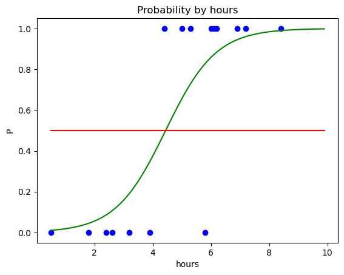
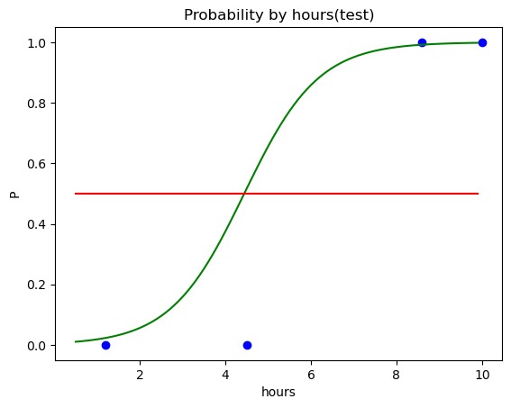

# 4. Logistic Regression

### 공부 시간에 따른 자격증 시험 합격 가능성


```python
import numpy as np
import matplotlib.pyplot as plt
import pandas as pd
```


```python
dataset = pd.read_csv('LogisticRegressionData.csv')
x = dataset.iloc[:,:-1].values
y = dataset.iloc[:,-1].values
x, y
```


    (array([[ 0.5],
            [ 1.2],
            [ 1.8],
            [ 2.4],
            [ 2.6],
            [ 3.2],
            [ 3.9],
            [ 4.4],
            [ 4.5],
            [ 5. ],
            [ 5.3],
            [ 5.8],
            [ 6. ],
            [ 6.1],
            [ 6.2],
            [ 6.9],
            [ 7.2],
            [ 8.4],
            [ 8.6],
            [10. ]]),
     array([0, 0, 0, 0, 0, 0, 0, 1, 0, 1, 1, 0, 1, 1, 1, 1, 1, 1, 1, 1]))


### 데이터 분리


```python
from sklearn.model_selection import train_test_split
x_train, x_test, y_train, y_test = train_test_split(x, y, test_size=0.2, random_state=0)
```

### 학습(로지스틱 회귀 모델)


```python
from sklearn.linear_model import LogisticRegression
classifier = LogisticRegression() #객체 생성

classifier.fit(x_train, y_train)
pred_six = classifier.predict([[6]])
```

### 6시간 공부했을 때 예측?


```python
pred_six
# 결과 1 : 합격할 것으로 예측
```


    array([1])


```python
classifier.predict_proba([[6]]) #합격 할  확률 출력
# 불합격 : 14%, 합격 : 86%
```


    array([[0.141483, 0.858517]])


### 4시간 공부했을 때 예측?


```python
pred_four = classifier.predict([[4]])
pred_four
#결과 0 : 불합격할 것으로 예측
```


    array([0])


```python
classifier.predict_proba([[4]]) #합격 할  확률 출력
# 불합격 : 62%, 합격 : 38%
```


    array([[0.62497682, 0.37502318]])


### 분류 결과 예측(테스트 세트)


```python
y_pred = classifier.predict(x_test)
y_pred
```


    array([1, 0, 1, 1])


```python
y_test # 실제 값 [테스트 세트]
```


    array([1, 0, 1, 0])


```python
x_test
```


    array([[ 8.6],
           [ 1.2],
           [10. ],
           [ 4.5]])


```python
classifier.score(x_test, y_test) #모델 평가
#전체 테스트 세트 4개 중에서 분류 예측 올바르게 맞힌 개수 3개 -> 3/4
```


    0.75


### 데이터 시각화(훈련 세트)


```python
x_min = np.min(x, axis=0)[0]
x_max = np.max(x, axis=0)[0]
x_range = np.arange(x_min, x_max, 0.1)
x_range, x_range.shape
```


    (array([0.5, 0.6, 0.7, 0.8, 0.9, 1. , 1.1, 1.2, 1.3, 1.4, 1.5, 1.6, 1.7,
            1.8, 1.9, 2. , 2.1, 2.2, 2.3, 2.4, 2.5, 2.6, 2.7, 2.8, 2.9, 3. ,
            3.1, 3.2, 3.3, 3.4, 3.5, 3.6, 3.7, 3.8, 3.9, 4. , 4.1, 4.2, 4.3,
            4.4, 4.5, 4.6, 4.7, 4.8, 4.9, 5. , 5.1, 5.2, 5.3, 5.4, 5.5, 5.6,
            5.7, 5.8, 5.9, 6. , 6.1, 6.2, 6.3, 6.4, 6.5, 6.6, 6.7, 6.8, 6.9,
            7. , 7.1, 7.2, 7.3, 7.4, 7.5, 7.6, 7.7, 7.8, 7.9, 8. , 8.1, 8.2,
            8.3, 8.4, 8.5, 8.6, 8.7, 8.8, 8.9, 9. , 9.1, 9.2, 9.3, 9.4, 9.5,
            9.6, 9.7, 9.8, 9.9]),
     (95,))


```python
# x_range에 대한 y_range를 구해야함. 
p = 1 / (1 + np.exp(-(classifier.coef_ * x_range + classifier.intercept_)))
p, p.shape #2차원 1로우 95컬럼
```


    (array([[0.01035583, 0.01161118, 0.0130167 , 0.01458984, 0.01634996,
             0.01831847, 0.02051904, 0.02297778, 0.0257234 , 0.02878743,
             0.03220437, 0.03601184, 0.04025075, 0.04496534, 0.05020326,
             0.05601555, 0.06245651, 0.06958349, 0.07745655, 0.08613794,
             0.09569142, 0.10618136, 0.1176716 , 0.13022408, 0.14389721,
             0.15874395, 0.17480973, 0.19213011, 0.21072838, 0.23061305,
             0.25177552, 0.27418791, 0.29780133, 0.32254464, 0.348324  ,
             0.37502318, 0.40250484, 0.43061281, 0.45917517, 0.4880083 ,
             0.51692146, 0.54572176, 0.57421932, 0.60223222, 0.62959096,
             0.65614237, 0.6817526 , 0.70630918, 0.72972211, 0.75192414,
             0.77287004, 0.79253536, 0.81091459, 0.82801892, 0.84387392,
             0.858517  , 0.87199503, 0.88436205, 0.89567719, 0.90600282,
             0.91540298, 0.923942  , 0.93168343, 0.9386892 , 0.94501893,
             0.95072949, 0.95587461, 0.96050477, 0.96466704, 0.96840509,
             0.97175925, 0.97476661, 0.97746114, 0.97987388, 0.98203308,
             0.98396443, 0.9856912 , 0.98723443, 0.98861315, 0.98984449,
             0.9909439 , 0.99192526, 0.99280104, 0.99358246, 0.99427954,
             0.9949013 , 0.99545578, 0.99595021, 0.99639104, 0.99678404,
             0.99713437, 0.99744663, 0.99772494, 0.99797298, 0.99819402]]),
     (1, 95))


```python
p = p.reshape(-1) # 한row로 즉 1차원으로 95개 요소를 가진 리스트로 만들어라 -1은 0부터~끝 인덱스까지를 가르킴
p, p.shape
```


    (array([0.01035583, 0.01161118, 0.0130167 , 0.01458984, 0.01634996,
            0.01831847, 0.02051904, 0.02297778, 0.0257234 , 0.02878743,
            0.03220437, 0.03601184, 0.04025075, 0.04496534, 0.05020326,
            0.05601555, 0.06245651, 0.06958349, 0.07745655, 0.08613794,
            0.09569142, 0.10618136, 0.1176716 , 0.13022408, 0.14389721,
            0.15874395, 0.17480973, 0.19213011, 0.21072838, 0.23061305,
            0.25177552, 0.27418791, 0.29780133, 0.32254464, 0.348324  ,
            0.37502318, 0.40250484, 0.43061281, 0.45917517, 0.4880083 ,
            0.51692146, 0.54572176, 0.57421932, 0.60223222, 0.62959096,
            0.65614237, 0.6817526 , 0.70630918, 0.72972211, 0.75192414,
            0.77287004, 0.79253536, 0.81091459, 0.82801892, 0.84387392,
            0.858517  , 0.87199503, 0.88436205, 0.89567719, 0.90600282,
            0.91540298, 0.923942  , 0.93168343, 0.9386892 , 0.94501893,
            0.95072949, 0.95587461, 0.96050477, 0.96466704, 0.96840509,
            0.97175925, 0.97476661, 0.97746114, 0.97987388, 0.98203308,
            0.98396443, 0.9856912 , 0.98723443, 0.98861315, 0.98984449,
            0.9909439 , 0.99192526, 0.99280104, 0.99358246, 0.99427954,
            0.9949013 , 0.99545578, 0.99595021, 0.99639104, 0.99678404,
            0.99713437, 0.99744663, 0.99772494, 0.99797298, 0.99819402]),
     (95,))


```python
plt.scatter(x_train, y_train, color="blue")
plt.plot(x_range, p, color="green") # p는 x_range에 대한 결과 값
plt.plot(x_range, np.full(len(x_range), 0.5), color='red') # x요소 개수만큼 0.5값으로 채움
plt.title('Probability by hours')
plt.xlabel('hours')
plt.ylabel('P')
plt.show()
```


    

    


### 데이터 시각화 (테스트 세트)


```python
plt.scatter(x_test, y_test, color="blue")
plt.plot(x_range, p, color="green") # p는 x_range에 대한 결과 값
plt.plot(x_range, np.full(len(x_range), 0.5), color='red') # x요소 개수만큼 0.5값으로 채움
plt.title('Probability by hours(test)')
plt.xlabel('hours')
plt.ylabel('P')
plt.show()
```


    

    


```python
classifier.predict_proba([[4.5]]) # 4.5시간 공부했을 때 확률 [모델에서는 51% 확률로 합격 예측, 실제로는 불합격]
```


    array([[0.48307854, 0.51692146]])


### 혼돈 행렬(Confusion Matrix)


```python
from sklearn.metrics import confusion_matrix
cm = confusion_matrix(y_test, y_pred)
cm
# TRUE NEGATIVE(TN)   FALSE POSITIVE (FP)
# 불합격일거야 (예측)      합격일거야(예측)
# 불합격 (실제)           불합격 (실제)

# FALSE NEGATIVE      TRUE POSITIVE
#불합격일거야 (예측)       합격일거야(예측)
# 합격 (실제)              합격(실제)

```


    array([[1, 1],
           [0, 2]])


