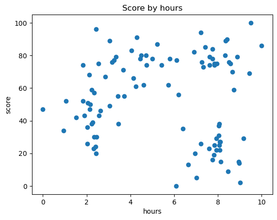
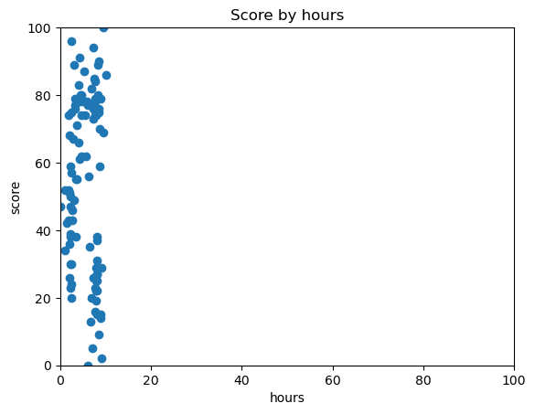
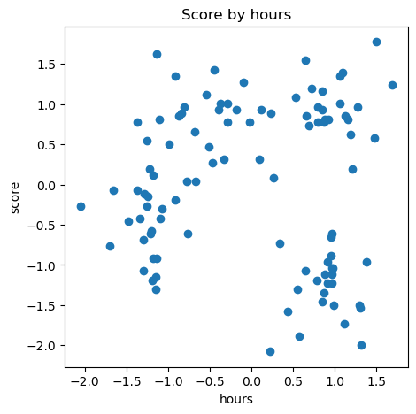
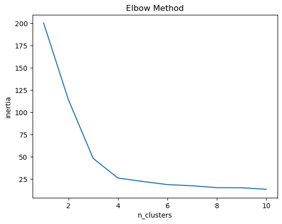
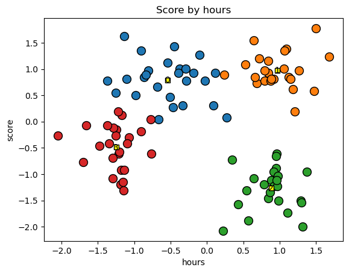
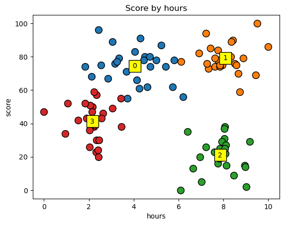

# 5. K-Means


```python
import numpy as np
import matplotlib.pyplot as plt
import pandas as pd
import os #경고 대응 #scaler 이전에 임포트 해주면 됨
os.environ['OMP_NUM_THREADS'] = '1'
```


```python
dataset = pd.read_csv('KMeansData.csv')
```


```python
X = dataset.iloc[:,:].values
# X = dataset.values
# X = dataset.to_numpy() # 공식 홈페이지 권장
X[:5]
```


    array([[ 7.33, 73.  ],
           [ 3.71, 55.  ],
           [ 3.43, 55.  ],
           [ 3.06, 89.  ],
           [ 3.33, 79.  ]])


### 데이터 시각화(전체 데이터 분포 확인)


```python
plt.scatter(X[:, 0], X[:, 1]) #x 축 : hour, y축 : score
plt.title("Score by hours")
plt.xlabel("hours")
plt.ylabel("score")
plt.show()
```


    

    


```python
plt.scatter(X[:, 0], X[:, 1]) #x 축 : hour, y축 : score
plt.title("Score by hours")
plt.xlabel("hours")
plt.xlim(0, 100)
plt.ylim(0, 100)
plt.ylabel("score")
plt.show()
```


    

    


### feature scaling


```python
from sklearn.preprocessing import StandardScaler
sc = StandardScaler()
X = sc.fit_transform(X)
X[:5]
```


    array([[ 0.68729921,  0.73538376],
           [-0.66687438,  0.04198891],
           [-0.77161709,  0.04198891],
           [-0.9100271 ,  1.35173473],
           [-0.8090252 ,  0.96651537]])


```python
plt.figure(figsize=(5, 5))
plt.scatter(X[:, 0], X[:, 1]) #x 축 : hour, y축 : score
plt.title("Score by hours")
plt.xlabel("hours")
plt.ylabel("score")
plt.show()
```


    

    


### 최적의 K값 찾기(엘보우 방식 Elbow Method)


```python
from sklearn.cluster import KMeans
inertia_list = []
for i in range(1, 11):
    kmeans = KMeans(n_clusters=i, init='k-means++', random_state=0)
    kmeans.fit(X)
    inertia_list.append(kmeans.inertia_) # 각 지점으로부터 클러스터의 중심(centroid)까지의 거리의 제곱의 
    
plt.plot(range(1, 11), inertia_list)
plt.title('Elbow Method')
plt.xlabel('n_clusters')
plt.ylabel('inertia')
plt.show()
```


    

    


### 최적의 K(4)값으로 KMeans 학습


```python
K = 4  #최적의 k값 제일 완만한 구간
```


```python
kmeans = KMeans(n_clusters=K, random_state=0)
# kmeans.fit(X)
y_kmeans = kmeans.fit_predict(X)
```


```python
y_kmeans[:3], X[:3]
```


    (array([1, 0, 3], dtype=int32),
     array([[ 0.68729921,  0.73538376],
            [-0.66687438,  0.04198891],
            [-0.77161709,  0.04198891]]))


### 데이터 시각화 (최적의 K)


```python
centers = kmeans.cluster_centers_ # 클러스터의 중심점 (cntroid) 좌표
centers
```


    array([[-0.54299598,  0.79316666],
           [ 0.96910697,  0.97133061],
           [ 0.8837666 , -1.26929779],
           [-1.24939347, -0.48807293]])


```python
for cluster in range(K):
    plt.scatter(X[cluster == y_kmeans, 0], X[cluster == y_kmeans, 1], s=100, edgecolor='black')
    plt.scatter(centers[cluster, 0], centers[cluster, 1], edgecolor='black', color='yellow', marker='s')
    plt.text(centers[cluster, 0], centers[cluster, 1], cluster, va='center', ha='center')

plt.title('Score by hours')
plt.xlabel('hours')
plt.ylabel('score')
plt.show()
```


    

    


### 데이터 시작화(스케일링 원복)


```python
X_org = sc.inverse_transform(X) # Feature Scaling 된 데이터를 다시 원복 내가 원복하고자하는 값을 넣음 그게 원래 값인 X
conters_org = sc.inverse_transform(centers)
X_org[:3], conters_org
```


    (array([[ 7.33, 73.  ],
            [ 3.71, 55.  ],
            [ 3.43, 55.  ]]),
     array([[ 4.04115385, 74.5       ],
            [ 8.08333333, 79.125     ],
            [ 7.8552    , 20.96      ],
            [ 2.1528    , 41.24      ]]))


```python
for cluster in range(K):
    plt.scatter(X_org[cluster == y_kmeans, 0], X_org[cluster == y_kmeans, 1], s=100, edgecolor='black')
    plt.scatter(conters_org[cluster, 0], conters_org[cluster, 1], s=300, edgecolor='black', color='yellow', marker='s')
    plt.text(conters_org[cluster, 0], conters_org[cluster, 1], cluster, va='center', ha='center')

plt.title('Score by hours')
plt.xlabel('hours')
plt.ylabel('score')
plt.show()
```


    

    

