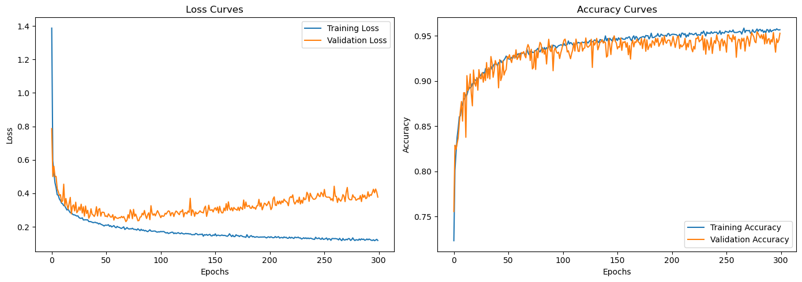
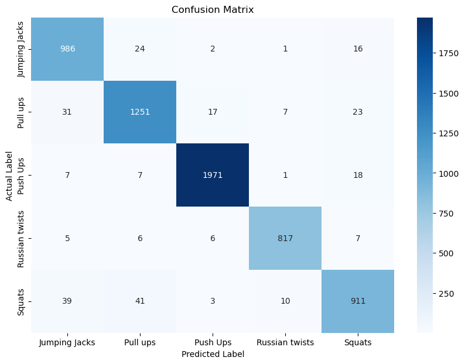

```python
import pandas as pd
import numpy as np
from sklearn.model_selection import train_test_split
from sklearn.preprocessing import LabelEncoder
from tensorflow import keras
from tensorflow.keras import layers
import matplotlib.pyplot as plt
import seaborn as sns
from sklearn.metrics import confusion_matrix, classification_report
```


```python
exercise_angles_dataset = pd.read_csv('exercise_angles.csv')
exercise_angles_dataset
```


<div>
<style scoped>
    .dataframe tbody tr th:only-of-type {
        vertical-align: middle;
    }

    .dataframe tbody tr th {
        vertical-align: top;
    }

    .dataframe thead th {
        text-align: right;
    }
</style>
<table border="1" class="dataframe">
  <thead>
    <tr style="text-align: right;">
      <th></th>
      <th>Side</th>
      <th>Shoulder_Angle</th>
      <th>Elbow_Angle</th>
      <th>Hip_Angle</th>
      <th>Knee_Angle</th>
      <th>Ankle_Angle</th>
      <th>Shoulder_Ground_Angle</th>
      <th>Elbow_Ground_Angle</th>
      <th>Hip_Ground_Angle</th>
      <th>Knee_Ground_Angle</th>
      <th>Ankle_Ground_Angle</th>
      <th>Label</th>
    </tr>
  </thead>
  <tbody>
    <tr>
      <th>0</th>
      <td>left</td>
      <td>10.639208</td>
      <td>174.466813</td>
      <td>174.785143</td>
      <td>179.848140</td>
      <td>179.419276</td>
      <td>90.0</td>
      <td>90.0</td>
      <td>90.0</td>
      <td>90.0</td>
      <td>90.0</td>
      <td>Jumping Jacks</td>
    </tr>
    <tr>
      <th>1</th>
      <td>left</td>
      <td>10.590342</td>
      <td>174.428706</td>
      <td>174.765042</td>
      <td>179.775215</td>
      <td>179.386147</td>
      <td>90.0</td>
      <td>90.0</td>
      <td>90.0</td>
      <td>90.0</td>
      <td>90.0</td>
      <td>Jumping Jacks</td>
    </tr>
    <tr>
      <th>2</th>
      <td>left</td>
      <td>10.546746</td>
      <td>174.489431</td>
      <td>174.785790</td>
      <td>179.660017</td>
      <td>179.333710</td>
      <td>90.0</td>
      <td>90.0</td>
      <td>90.0</td>
      <td>90.0</td>
      <td>90.0</td>
      <td>Jumping Jacks</td>
    </tr>
    <tr>
      <th>3</th>
      <td>left</td>
      <td>10.487682</td>
      <td>174.614913</td>
      <td>174.759542</td>
      <td>179.614223</td>
      <td>179.313926</td>
      <td>90.0</td>
      <td>90.0</td>
      <td>90.0</td>
      <td>90.0</td>
      <td>90.0</td>
      <td>Jumping Jacks</td>
    </tr>
    <tr>
      <th>4</th>
      <td>left</td>
      <td>10.412107</td>
      <td>174.758503</td>
      <td>174.737721</td>
      <td>179.570564</td>
      <td>179.298805</td>
      <td>90.0</td>
      <td>90.0</td>
      <td>90.0</td>
      <td>90.0</td>
      <td>90.0</td>
      <td>Jumping Jacks</td>
    </tr>
    <tr>
      <th>...</th>
      <td>...</td>
      <td>...</td>
      <td>...</td>
      <td>...</td>
      <td>...</td>
      <td>...</td>
      <td>...</td>
      <td>...</td>
      <td>...</td>
      <td>...</td>
      <td>...</td>
      <td>...</td>
    </tr>
    <tr>
      <th>31028</th>
      <td>left</td>
      <td>12.723974</td>
      <td>81.226330</td>
      <td>149.356832</td>
      <td>154.358415</td>
      <td>178.103121</td>
      <td>90.0</td>
      <td>90.0</td>
      <td>90.0</td>
      <td>90.0</td>
      <td>-90.0</td>
      <td>Russian twists</td>
    </tr>
    <tr>
      <th>31029</th>
      <td>left</td>
      <td>9.080920</td>
      <td>82.486551</td>
      <td>148.100509</td>
      <td>152.680540</td>
      <td>178.625318</td>
      <td>90.0</td>
      <td>90.0</td>
      <td>90.0</td>
      <td>90.0</td>
      <td>-90.0</td>
      <td>Russian twists</td>
    </tr>
    <tr>
      <th>31030</th>
      <td>left</td>
      <td>4.118076</td>
      <td>85.164707</td>
      <td>148.329461</td>
      <td>152.458288</td>
      <td>178.605852</td>
      <td>90.0</td>
      <td>90.0</td>
      <td>90.0</td>
      <td>90.0</td>
      <td>-90.0</td>
      <td>Russian twists</td>
    </tr>
    <tr>
      <th>31031</th>
      <td>left</td>
      <td>0.558065</td>
      <td>89.419330</td>
      <td>146.742440</td>
      <td>149.930600</td>
      <td>179.604753</td>
      <td>90.0</td>
      <td>90.0</td>
      <td>90.0</td>
      <td>90.0</td>
      <td>-90.0</td>
      <td>Russian twists</td>
    </tr>
    <tr>
      <th>31032</th>
      <td>left</td>
      <td>3.610121</td>
      <td>89.992518</td>
      <td>141.439189</td>
      <td>144.633832</td>
      <td>179.616705</td>
      <td>90.0</td>
      <td>90.0</td>
      <td>90.0</td>
      <td>90.0</td>
      <td>-90.0</td>
      <td>Russian twists</td>
    </tr>
  </tbody>
</table>
<p>31033 rows × 12 columns</p>
</div>


```python
features = []

for column in exercise_angles_dataset.columns:
    features.append(column)

targets = features.pop()
```


```python
del features[0]
features
```


    ['Shoulder_Angle',
     'Elbow_Angle',
     'Hip_Angle',
     'Knee_Angle',
     'Ankle_Angle',
     'Shoulder_Ground_Angle',
     'Elbow_Ground_Angle',
     'Hip_Ground_Angle',
     'Knee_Ground_Angle',
     'Ankle_Ground_Angle']


```python
targets
```


    'Label'


```python
label_encoder = LabelEncoder()
exercise_angles_dataset[targets] = label_encoder.fit_transform(exercise_angles_dataset[targets])

exercise_predictors = exercise_angles_dataset[features].values
exercise_categories = exercise_angles_dataset[targets].values
exercise_predictors_train, exercise_predictors_test, exercise_categories_train, exercise_categories_test = train_test_split(exercise_predictors, exercise_categories, test_size = 0.2, random_state = 42)
exercise_angles_dataset[targets].values
```


    array([0, 0, 0, ..., 3, 3, 3])


```python
model = keras.Sequential([
    layers.Input(shape = (exercise_predictors_train.shape[1],)),
    layers.Dense(64, activation = 'relu'),
    layers.Dense(64, activation = 'relu'),
    layers.Dense(len(np.unique(exercise_categories)), activation='softmax')
])
 
model.compile(optimizer = 'adam',
              loss = 'sparse_categorical_crossentropy',
              metrics = ['accuracy'])

history = model.fit(exercise_predictors_train, exercise_categories_train, epochs=300, batch_size=32, validation_split=0.2)
```

    Epoch 1/300
    621/621 ━━━━━━━━━━━━━━━━━━━━ 0s 418us/step - accuracy: 0.6372 - loss: 3.5317 - val_accuracy: 0.7555 - val_loss: 0.7866
    Epoch 2/300
    621/621 ━━━━━━━━━━━━━━━━━━━━ 0s 254us/step - accuracy: 0.7986 - loss: 0.5973 - val_accuracy: 0.8288 - val_loss: 0.5003
    Epoch 3/300
    621/621 ━━━━━━━━━━━━━━━━━━━━ 0s 252us/step - accuracy: 0.8263 - loss: 0.5016 - val_accuracy: 0.8244 - val_loss: 0.5615
    Epoch 4/300
    621/621 ━━━━━━━━━━━━━━━━━━━━ 0s 254us/step - accuracy: 0.8368 - loss: 0.4641 - val_accuracy: 0.8308 - val_loss: 0.4997
    Epoch 5/300
    621/621 ━━━━━━━━━━━━━━━━━━━━ 0s 253us/step - accuracy: 0.8441 - loss: 0.4360 - val_accuracy: 0.8373 - val_loss: 0.5015
    Epoch 6/300
    621/621 ━━━━━━━━━━━━━━━━━━━━ 0s 289us/step - accuracy: 0.8577 - loss: 0.3980 - val_accuracy: 0.8534 - val_loss: 0.4294
    Epoch 7/300
    621/621 ━━━━━━━━━━━━━━━━━━━━ 0s 253us/step - accuracy: 0.8576 - loss: 0.3996 - val_accuracy: 0.8675 - val_loss: 0.4100
    Epoch 8/300
    621/621 ━━━━━━━━━━━━━━━━━━━━ 0s 255us/step - accuracy: 0.8702 - loss: 0.3670 - val_accuracy: 0.8774 - val_loss: 0.3872
    Epoch 9/300
    621/621 ━━━━━━━━━━━━━━━━━━━━ 0s 254us/step - accuracy: 0.8782 - loss: 0.3390 - val_accuracy: 0.8556 - val_loss: 0.3922
    Epoch 10/300
    621/621 ━━━━━━━━━━━━━━━━━━━━ 0s 255us/step - accuracy: 0.8860 - loss: 0.3314 - val_accuracy: 0.8870 - val_loss: 0.3478
    Epoch 11/300
    621/621 ━━━━━━━━━━━━━━━━━━━━ 0s 254us/step - accuracy: 0.8779 - loss: 0.3444 - val_accuracy: 0.8870 - val_loss: 0.3562
    Epoch 12/300
    621/621 ━━━━━━━━━━━━━━━━━━━━ 0s 289us/step - accuracy: 0.8859 - loss: 0.3206 - val_accuracy: 0.8377 - val_loss: 0.4549
    Epoch 13/300
    621/621 ━━━━━━━━━━━━━━━━━━━━ 0s 256us/step - accuracy: 0.8820 - loss: 0.3263 - val_accuracy: 0.9060 - val_loss: 0.3244
    Epoch 14/300
    621/621 ━━━━━━━━━━━━━━━━━━━━ 0s 261us/step - accuracy: 0.8886 - loss: 0.3174 - val_accuracy: 0.8896 - val_loss: 0.3693
    Epoch 15/300
    621/621 ━━━━━━━━━━━━━━━━━━━━ 0s 254us/step - accuracy: 0.8895 - loss: 0.3103 - val_accuracy: 0.8931 - val_loss: 0.3314
    Epoch 16/300
    621/621 ━━━━━━━━━━━━━━━━━━━━ 0s 252us/step - accuracy: 0.8886 - loss: 0.3160 - val_accuracy: 0.9078 - val_loss: 0.3054
    Epoch 17/300
    621/621 ━━━━━━━━━━━━━━━━━━━━ 0s 252us/step - accuracy: 0.8914 - loss: 0.2917 - val_accuracy: 0.8858 - val_loss: 0.3422
    Epoch 18/300
    621/621 ━━━━━━━━━━━━━━━━━━━━ 0s 255us/step - accuracy: 0.8978 - loss: 0.2786 - val_accuracy: 0.8725 - val_loss: 0.3758
    Epoch 19/300
    621/621 ━━━━━━━━━━━━━━━━━━━━ 0s 255us/step - accuracy: 0.8961 - loss: 0.2874 - val_accuracy: 0.9122 - val_loss: 0.2777
    Epoch 20/300
    621/621 ━━━━━━━━━━━━━━━━━━━━ 0s 254us/step - accuracy: 0.9013 - loss: 0.2721 - val_accuracy: 0.8983 - val_loss: 0.3230
    Epoch 21/300
    621/621 ━━━━━━━━━━━━━━━━━━━━ 0s 258us/step - accuracy: 0.9017 - loss: 0.2689 - val_accuracy: 0.8943 - val_loss: 0.3313
    Epoch 22/300
    621/621 ━━━━━━━━━━━━━━━━━━━━ 0s 283us/step - accuracy: 0.9010 - loss: 0.2699 - val_accuracy: 0.9039 - val_loss: 0.2952
    Epoch 23/300
    621/621 ━━━━━━━━━━━━━━━━━━━━ 0s 257us/step - accuracy: 0.9042 - loss: 0.2591 - val_accuracy: 0.8899 - val_loss: 0.3473
    Epoch 24/300
    621/621 ━━━━━━━━━━━━━━━━━━━━ 0s 259us/step - accuracy: 0.9052 - loss: 0.2644 - val_accuracy: 0.9126 - val_loss: 0.2845
    Epoch 25/300
    621/621 ━━━━━━━━━━━━━━━━━━━━ 0s 262us/step - accuracy: 0.9085 - loss: 0.2580 - val_accuracy: 0.9033 - val_loss: 0.2944
    Epoch 26/300
    621/621 ━━━━━━━━━━━━━━━━━━━━ 0s 261us/step - accuracy: 0.9075 - loss: 0.2535 - val_accuracy: 0.9023 - val_loss: 0.3191
    Epoch 27/300
    621/621 ━━━━━━━━━━━━━━━━━━━━ 0s 257us/step - accuracy: 0.9074 - loss: 0.2498 - val_accuracy: 0.9092 - val_loss: 0.2988
    Epoch 28/300
    621/621 ━━━━━━━━━━━━━━━━━━━━ 0s 259us/step - accuracy: 0.9111 - loss: 0.2476 - val_accuracy: 0.8987 - val_loss: 0.3353
    Epoch 29/300
    621/621 ━━━━━━━━━━━━━━━━━━━━ 0s 258us/step - accuracy: 0.9100 - loss: 0.2502 - val_accuracy: 0.9084 - val_loss: 0.2827
    Epoch 30/300
    621/621 ━━━━━━━━━━━━━━━━━━━━ 0s 254us/step - accuracy: 0.9130 - loss: 0.2386 - val_accuracy: 0.9005 - val_loss: 0.3199
    Epoch 31/300
    621/621 ━━━━━━━━━━━━━━━━━━━━ 0s 289us/step - accuracy: 0.9093 - loss: 0.2451 - val_accuracy: 0.9205 - val_loss: 0.2639
    Epoch 32/300
    621/621 ━━━━━━━━━━━━━━━━━━━━ 0s 255us/step - accuracy: 0.9157 - loss: 0.2325 - val_accuracy: 0.9033 - val_loss: 0.3242
    Epoch 33/300
    621/621 ━━━━━━━━━━━━━━━━━━━━ 0s 253us/step - accuracy: 0.9117 - loss: 0.2436 - val_accuracy: 0.9148 - val_loss: 0.2796
    Epoch 34/300
    621/621 ━━━━━━━━━━━━━━━━━━━━ 0s 254us/step - accuracy: 0.9168 - loss: 0.2339 - val_accuracy: 0.9023 - val_loss: 0.2990
    Epoch 35/300
    621/621 ━━━━━━━━━━━━━━━━━━━━ 0s 260us/step - accuracy: 0.9113 - loss: 0.2441 - val_accuracy: 0.9271 - val_loss: 0.2519
    Epoch 36/300
    621/621 ━━━━━━━━━━━━━━━━━━━━ 0s 265us/step - accuracy: 0.9145 - loss: 0.2289 - val_accuracy: 0.9203 - val_loss: 0.2658
    Epoch 37/300
    621/621 ━━━━━━━━━━━━━━━━━━━━ 0s 268us/step - accuracy: 0.9160 - loss: 0.2295 - val_accuracy: 0.9041 - val_loss: 0.3080
    Epoch 38/300
    621/621 ━━━━━━━━━━━━━━━━━━━━ 0s 262us/step - accuracy: 0.9218 - loss: 0.2241 - val_accuracy: 0.9110 - val_loss: 0.2760
    Epoch 39/300
    621/621 ━━━━━━━━━━━━━━━━━━━━ 0s 295us/step - accuracy: 0.9217 - loss: 0.2142 - val_accuracy: 0.9227 - val_loss: 0.2708
    Epoch 40/300
    621/621 ━━━━━━━━━━━━━━━━━━━━ 0s 265us/step - accuracy: 0.9201 - loss: 0.2222 - val_accuracy: 0.9188 - val_loss: 0.2619
    Epoch 41/300
    621/621 ━━━━━━━━━━━━━━━━━━━━ 0s 263us/step - accuracy: 0.9219 - loss: 0.2149 - val_accuracy: 0.9180 - val_loss: 0.2775
    Epoch 42/300
    621/621 ━━━━━━━━━━━━━━━━━━━━ 0s 259us/step - accuracy: 0.9213 - loss: 0.2167 - val_accuracy: 0.8925 - val_loss: 0.3202
    Epoch 43/300
    621/621 ━━━━━━━━━━━━━━━━━━━━ 0s 263us/step - accuracy: 0.9198 - loss: 0.2204 - val_accuracy: 0.9237 - val_loss: 0.2649
    Epoch 44/300
    621/621 ━━━━━━━━━━━━━━━━━━━━ 0s 262us/step - accuracy: 0.9243 - loss: 0.2104 - val_accuracy: 0.9005 - val_loss: 0.3040
    Epoch 45/300
    621/621 ━━━━━━━━━━━━━━━━━━━━ 0s 292us/step - accuracy: 0.9194 - loss: 0.2245 - val_accuracy: 0.9048 - val_loss: 0.3093
    Epoch 46/300
    621/621 ━━━━━━━━━━━━━━━━━━━━ 0s 263us/step - accuracy: 0.9251 - loss: 0.2171 - val_accuracy: 0.9225 - val_loss: 0.2638
    Epoch 47/300
    621/621 ━━━━━━━━━━━━━━━━━━━━ 0s 259us/step - accuracy: 0.9268 - loss: 0.2017 - val_accuracy: 0.9066 - val_loss: 0.2871
    Epoch 48/300
    621/621 ━━━━━━━━━━━━━━━━━━━━ 0s 263us/step - accuracy: 0.9269 - loss: 0.1999 - val_accuracy: 0.9106 - val_loss: 0.2874
    Epoch 49/300
    621/621 ━━━━━━━━━━━━━━━━━━━━ 0s 260us/step - accuracy: 0.9278 - loss: 0.2021 - val_accuracy: 0.9128 - val_loss: 0.2859
    Epoch 50/300
    621/621 ━━━━━━━━━━━━━━━━━━━━ 0s 261us/step - accuracy: 0.9254 - loss: 0.2132 - val_accuracy: 0.9271 - val_loss: 0.2625
    Epoch 51/300
    621/621 ━━━━━━━━━━━━━━━━━━━━ 0s 260us/step - accuracy: 0.9257 - loss: 0.2108 - val_accuracy: 0.9253 - val_loss: 0.2653
    Epoch 52/300
    621/621 ━━━━━━━━━━━━━━━━━━━━ 0s 295us/step - accuracy: 0.9259 - loss: 0.2047 - val_accuracy: 0.9291 - val_loss: 0.2597
    Epoch 53/300
    621/621 ━━━━━━━━━━━━━━━━━━━━ 0s 265us/step - accuracy: 0.9238 - loss: 0.2114 - val_accuracy: 0.9237 - val_loss: 0.2778
    Epoch 54/300
    621/621 ━━━━━━━━━━━━━━━━━━━━ 0s 260us/step - accuracy: 0.9262 - loss: 0.2050 - val_accuracy: 0.9205 - val_loss: 0.2679
    Epoch 55/300
    621/621 ━━━━━━━━━━━━━━━━━━━━ 0s 259us/step - accuracy: 0.9247 - loss: 0.2115 - val_accuracy: 0.9279 - val_loss: 0.2581
    Epoch 56/300
    621/621 ━━━━━━━━━━━━━━━━━━━━ 0s 262us/step - accuracy: 0.9267 - loss: 0.2045 - val_accuracy: 0.9287 - val_loss: 0.2587
    Epoch 57/300
    621/621 ━━━━━━━━━━━━━━━━━━━━ 0s 258us/step - accuracy: 0.9269 - loss: 0.1988 - val_accuracy: 0.9251 - val_loss: 0.2728
    Epoch 58/300
    621/621 ━━━━━━━━━━━━━━━━━━━━ 0s 261us/step - accuracy: 0.9258 - loss: 0.2090 - val_accuracy: 0.9346 - val_loss: 0.2403
    Epoch 59/300
    621/621 ━━━━━━━━━━━━━━━━━━━━ 0s 308us/step - accuracy: 0.9276 - loss: 0.1992 - val_accuracy: 0.9239 - val_loss: 0.2623
    Epoch 60/300
    621/621 ━━━━━━━━━━━━━━━━━━━━ 0s 262us/step - accuracy: 0.9321 - loss: 0.1862 - val_accuracy: 0.9263 - val_loss: 0.2550
    Epoch 61/300
    621/621 ━━━━━━━━━━━━━━━━━━━━ 0s 259us/step - accuracy: 0.9267 - loss: 0.1959 - val_accuracy: 0.9305 - val_loss: 0.2512
    Epoch 62/300
    621/621 ━━━━━━━━━━━━━━━━━━━━ 0s 258us/step - accuracy: 0.9303 - loss: 0.2009 - val_accuracy: 0.9233 - val_loss: 0.2509
    Epoch 63/300
    621/621 ━━━━━━━━━━━━━━━━━━━━ 0s 258us/step - accuracy: 0.9328 - loss: 0.1891 - val_accuracy: 0.9315 - val_loss: 0.2560
    Epoch 64/300
    621/621 ━━━━━━━━━━━━━━━━━━━━ 0s 258us/step - accuracy: 0.9327 - loss: 0.1918 - val_accuracy: 0.9307 - val_loss: 0.2539
    Epoch 65/300
    621/621 ━━━━━━━━━━━━━━━━━━━━ 0s 292us/step - accuracy: 0.9328 - loss: 0.1911 - val_accuracy: 0.9325 - val_loss: 0.2627
    Epoch 66/300
    621/621 ━━━━━━━━━━━━━━━━━━━━ 0s 265us/step - accuracy: 0.9293 - loss: 0.1975 - val_accuracy: 0.9283 - val_loss: 0.2548
    Epoch 67/300
    621/621 ━━━━━━━━━━━━━━━━━━━━ 0s 265us/step - accuracy: 0.9298 - loss: 0.2027 - val_accuracy: 0.9257 - val_loss: 0.2616
    Epoch 68/300
    621/621 ━━━━━━━━━━━━━━━━━━━━ 0s 259us/step - accuracy: 0.9382 - loss: 0.1760 - val_accuracy: 0.9362 - val_loss: 0.2477
    Epoch 69/300
    621/621 ━━━━━━━━━━━━━━━━━━━━ 0s 265us/step - accuracy: 0.9342 - loss: 0.1856 - val_accuracy: 0.9404 - val_loss: 0.2312
    Epoch 70/300
    621/621 ━━━━━━━━━━━━━━━━━━━━ 0s 294us/step - accuracy: 0.9308 - loss: 0.1936 - val_accuracy: 0.9372 - val_loss: 0.2402
    Epoch 71/300
    621/621 ━━━━━━━━━━━━━━━━━━━━ 0s 263us/step - accuracy: 0.9340 - loss: 0.1829 - val_accuracy: 0.9227 - val_loss: 0.2726
    Epoch 72/300
    621/621 ━━━━━━━━━━━━━━━━━━━━ 0s 262us/step - accuracy: 0.9345 - loss: 0.1838 - val_accuracy: 0.9352 - val_loss: 0.2519
    Epoch 73/300
    621/621 ━━━━━━━━━━━━━━━━━━━━ 0s 261us/step - accuracy: 0.9326 - loss: 0.1903 - val_accuracy: 0.9134 - val_loss: 0.3022
    Epoch 74/300
    621/621 ━━━━━━━━━━━━━━━━━━━━ 0s 268us/step - accuracy: 0.9356 - loss: 0.1795 - val_accuracy: 0.9150 - val_loss: 0.2872
    Epoch 75/300
    621/621 ━━━━━━━━━━━━━━━━━━━━ 0s 262us/step - accuracy: 0.9359 - loss: 0.1832 - val_accuracy: 0.9337 - val_loss: 0.2488
    Epoch 76/300
    621/621 ━━━━━━━━━━━━━━━━━━━━ 0s 300us/step - accuracy: 0.9363 - loss: 0.1799 - val_accuracy: 0.9128 - val_loss: 0.3045
    Epoch 77/300
    621/621 ━━━━━━━━━━━━━━━━━━━━ 0s 264us/step - accuracy: 0.9351 - loss: 0.1788 - val_accuracy: 0.9335 - val_loss: 0.2629
    Epoch 78/300
    621/621 ━━━━━━━━━━━━━━━━━━━━ 0s 263us/step - accuracy: 0.9390 - loss: 0.1835 - val_accuracy: 0.9257 - val_loss: 0.2760
    Epoch 79/300
    621/621 ━━━━━━━━━━━━━━━━━━━━ 0s 260us/step - accuracy: 0.9315 - loss: 0.1882 - val_accuracy: 0.9362 - val_loss: 0.2579
    Epoch 80/300
    621/621 ━━━━━━━━━━━━━━━━━━━━ 0s 258us/step - accuracy: 0.9293 - loss: 0.1908 - val_accuracy: 0.9428 - val_loss: 0.2362
    Epoch 81/300
    621/621 ━━━━━━━━━━━━━━━━━━━━ 0s 319us/step - accuracy: 0.9340 - loss: 0.1833 - val_accuracy: 0.9408 - val_loss: 0.2379
    Epoch 82/300
    621/621 ━━━━━━━━━━━━━━━━━━━━ 0s 274us/step - accuracy: 0.9373 - loss: 0.1792 - val_accuracy: 0.9313 - val_loss: 0.2582
    Epoch 83/300
    621/621 ━━━━━━━━━━━━━━━━━━━━ 0s 268us/step - accuracy: 0.9321 - loss: 0.1851 - val_accuracy: 0.9356 - val_loss: 0.2603
    Epoch 84/300
    621/621 ━━━━━━━━━━━━━━━━━━━━ 0s 298us/step - accuracy: 0.9371 - loss: 0.1789 - val_accuracy: 0.9297 - val_loss: 0.2811
    Epoch 85/300
    621/621 ━━━━━━━━━━━━━━━━━━━━ 0s 311us/step - accuracy: 0.9356 - loss: 0.1783 - val_accuracy: 0.9348 - val_loss: 0.2713
    Epoch 86/300
    621/621 ━━━━━━━━━━━━━━━━━━━━ 0s 265us/step - accuracy: 0.9362 - loss: 0.1781 - val_accuracy: 0.9188 - val_loss: 0.2978
    Epoch 87/300
    621/621 ━━━━━━━━━━━━━━━━━━━━ 0s 258us/step - accuracy: 0.9344 - loss: 0.1763 - val_accuracy: 0.9348 - val_loss: 0.2674
    Epoch 88/300
    621/621 ━━━━━━━━━━━━━━━━━━━━ 0s 261us/step - accuracy: 0.9367 - loss: 0.1774 - val_accuracy: 0.9462 - val_loss: 0.2497
    Epoch 89/300
    621/621 ━━━━━━━━━━━━━━━━━━━━ 0s 293us/step - accuracy: 0.9378 - loss: 0.1739 - val_accuracy: 0.9348 - val_loss: 0.2728
    Epoch 90/300
    621/621 ━━━━━━━━━━━━━━━━━━━━ 0s 264us/step - accuracy: 0.9387 - loss: 0.1677 - val_accuracy: 0.9325 - val_loss: 0.2841
    Epoch 91/300
    621/621 ━━━━━━━━━━━━━━━━━━━━ 0s 258us/step - accuracy: 0.9381 - loss: 0.1721 - val_accuracy: 0.9398 - val_loss: 0.2430
    Epoch 92/300
    621/621 ━━━━━━━━━━━━━━━━━━━━ 0s 264us/step - accuracy: 0.9416 - loss: 0.1709 - val_accuracy: 0.9114 - val_loss: 0.3264
    Epoch 93/300
    621/621 ━━━━━━━━━━━━━━━━━━━━ 0s 306us/step - accuracy: 0.9425 - loss: 0.1677 - val_accuracy: 0.9337 - val_loss: 0.2818
    Epoch 94/300
    621/621 ━━━━━━━━━━━━━━━━━━━━ 0s 261us/step - accuracy: 0.9377 - loss: 0.1815 - val_accuracy: 0.9370 - val_loss: 0.2695
    Epoch 95/300
    621/621 ━━━━━━━━━━━━━━━━━━━━ 0s 262us/step - accuracy: 0.9390 - loss: 0.1691 - val_accuracy: 0.9323 - val_loss: 0.2785
    Epoch 96/300
    621/621 ━━━━━━━━━━━━━━━━━━━━ 0s 261us/step - accuracy: 0.9390 - loss: 0.1713 - val_accuracy: 0.9307 - val_loss: 0.2656
    Epoch 97/300
    621/621 ━━━━━━━━━━━━━━━━━━━━ 0s 291us/step - accuracy: 0.9396 - loss: 0.1709 - val_accuracy: 0.9319 - val_loss: 0.2818
    Epoch 98/300
    621/621 ━━━━━━━━━━━━━━━━━━━━ 0s 266us/step - accuracy: 0.9413 - loss: 0.1620 - val_accuracy: 0.9249 - val_loss: 0.2967
    Epoch 99/300
    621/621 ━━━━━━━━━━━━━━━━━━━━ 0s 271us/step - accuracy: 0.9395 - loss: 0.1680 - val_accuracy: 0.9309 - val_loss: 0.2837
    Epoch 100/300
    621/621 ━━━━━━━━━━━━━━━━━━━━ 0s 266us/step - accuracy: 0.9459 - loss: 0.1540 - val_accuracy: 0.9354 - val_loss: 0.2692
    Epoch 101/300
    621/621 ━━━━━━━━━━━━━━━━━━━━ 0s 311us/step - accuracy: 0.9422 - loss: 0.1627 - val_accuracy: 0.9410 - val_loss: 0.2551
    Epoch 102/300
    621/621 ━━━━━━━━━━━━━━━━━━━━ 0s 282us/step - accuracy: 0.9409 - loss: 0.1700 - val_accuracy: 0.9452 - val_loss: 0.2675
    Epoch 103/300
    621/621 ━━━━━━━━━━━━━━━━━━━━ 0s 270us/step - accuracy: 0.9399 - loss: 0.1692 - val_accuracy: 0.9464 - val_loss: 0.2628
    Epoch 104/300
    621/621 ━━━━━━━━━━━━━━━━━━━━ 0s 302us/step - accuracy: 0.9382 - loss: 0.1695 - val_accuracy: 0.9404 - val_loss: 0.2647
    Epoch 105/300
    621/621 ━━━━━━━━━━━━━━━━━━━━ 0s 262us/step - accuracy: 0.9397 - loss: 0.1679 - val_accuracy: 0.9321 - val_loss: 0.2813
    Epoch 106/300
    621/621 ━━━━━━━━━━━━━━━━━━━━ 0s 265us/step - accuracy: 0.9458 - loss: 0.1607 - val_accuracy: 0.9335 - val_loss: 0.2763
    Epoch 107/300
    621/621 ━━━━━━━━━━━━━━━━━━━━ 0s 292us/step - accuracy: 0.9402 - loss: 0.1680 - val_accuracy: 0.9289 - val_loss: 0.2875
    Epoch 108/300
    621/621 ━━━━━━━━━━━━━━━━━━━━ 0s 259us/step - accuracy: 0.9417 - loss: 0.1631 - val_accuracy: 0.9247 - val_loss: 0.2957
    Epoch 109/300
    621/621 ━━━━━━━━━━━━━━━━━━━━ 0s 260us/step - accuracy: 0.9420 - loss: 0.1596 - val_accuracy: 0.9303 - val_loss: 0.2922
    Epoch 110/300
    621/621 ━━━━━━━━━━━━━━━━━━━━ 0s 257us/step - accuracy: 0.9402 - loss: 0.1630 - val_accuracy: 0.9346 - val_loss: 0.2658
    Epoch 111/300
    621/621 ━━━━━━━━━━━━━━━━━━━━ 0s 290us/step - accuracy: 0.9456 - loss: 0.1589 - val_accuracy: 0.9424 - val_loss: 0.2839
    Epoch 112/300
    621/621 ━━━━━━━━━━━━━━━━━━━━ 0s 265us/step - accuracy: 0.9402 - loss: 0.1631 - val_accuracy: 0.9331 - val_loss: 0.2837
    Epoch 113/300
    621/621 ━━━━━━━━━━━━━━━━━━━━ 0s 288us/step - accuracy: 0.9444 - loss: 0.1522 - val_accuracy: 0.9464 - val_loss: 0.2617
    Epoch 114/300
    621/621 ━━━━━━━━━━━━━━━━━━━━ 0s 292us/step - accuracy: 0.9446 - loss: 0.1562 - val_accuracy: 0.9402 - val_loss: 0.2822
    Epoch 115/300
    621/621 ━━━━━━━━━━━━━━━━━━━━ 0s 259us/step - accuracy: 0.9401 - loss: 0.1641 - val_accuracy: 0.9329 - val_loss: 0.2947
    Epoch 116/300
    621/621 ━━━━━━━━━━━━━━━━━━━━ 0s 265us/step - accuracy: 0.9418 - loss: 0.1608 - val_accuracy: 0.9327 - val_loss: 0.2892
    Epoch 117/300
    621/621 ━━━━━━━━━━━━━━━━━━━━ 0s 293us/step - accuracy: 0.9428 - loss: 0.1603 - val_accuracy: 0.9416 - val_loss: 0.2794
    Epoch 118/300
    621/621 ━━━━━━━━━━━━━━━━━━━━ 0s 260us/step - accuracy: 0.9442 - loss: 0.1582 - val_accuracy: 0.9428 - val_loss: 0.2728
    Epoch 119/300
    621/621 ━━━━━━━━━━━━━━━━━━━━ 0s 260us/step - accuracy: 0.9447 - loss: 0.1572 - val_accuracy: 0.9331 - val_loss: 0.2921
    Epoch 120/300
    621/621 ━━━━━━━━━━━━━━━━━━━━ 0s 262us/step - accuracy: 0.9430 - loss: 0.1617 - val_accuracy: 0.9362 - val_loss: 0.2903
    Epoch 121/300
    621/621 ━━━━━━━━━━━━━━━━━━━━ 0s 304us/step - accuracy: 0.9436 - loss: 0.1552 - val_accuracy: 0.9366 - val_loss: 0.3027
    Epoch 122/300
    621/621 ━━━━━━━━━━━━━━━━━━━━ 0s 262us/step - accuracy: 0.9473 - loss: 0.1521 - val_accuracy: 0.9476 - val_loss: 0.2596
    Epoch 123/300
    621/621 ━━━━━━━━━━━━━━━━━━━━ 0s 260us/step - accuracy: 0.9438 - loss: 0.1567 - val_accuracy: 0.9386 - val_loss: 0.2832
    Epoch 124/300
    621/621 ━━━━━━━━━━━━━━━━━━━━ 0s 271us/step - accuracy: 0.9427 - loss: 0.1584 - val_accuracy: 0.9374 - val_loss: 0.2850
    Epoch 125/300
    621/621 ━━━━━━━━━━━━━━━━━━━━ 0s 261us/step - accuracy: 0.9435 - loss: 0.1549 - val_accuracy: 0.9386 - val_loss: 0.2776
    Epoch 126/300
    621/621 ━━━━━━━━━━━━━━━━━━━━ 0s 262us/step - accuracy: 0.9430 - loss: 0.1607 - val_accuracy: 0.9398 - val_loss: 0.2948
    Epoch 127/300
    621/621 ━━━━━━━━━━━━━━━━━━━━ 0s 308us/step - accuracy: 0.9446 - loss: 0.1528 - val_accuracy: 0.9462 - val_loss: 0.2863
    Epoch 128/300
    621/621 ━━━━━━━━━━━━━━━━━━━━ 0s 332us/step - accuracy: 0.9447 - loss: 0.1551 - val_accuracy: 0.9150 - val_loss: 0.3705
    Epoch 129/300
    621/621 ━━━━━━━━━━━━━━━━━━━━ 0s 328us/step - accuracy: 0.9436 - loss: 0.1559 - val_accuracy: 0.9444 - val_loss: 0.2677
    Epoch 130/300
    621/621 ━━━━━━━━━━━━━━━━━━━━ 0s 259us/step - accuracy: 0.9472 - loss: 0.1459 - val_accuracy: 0.9398 - val_loss: 0.3021
    Epoch 131/300
    621/621 ━━━━━━━━━━━━━━━━━━━━ 0s 265us/step - accuracy: 0.9437 - loss: 0.1546 - val_accuracy: 0.9424 - val_loss: 0.2919
    Epoch 132/300
    621/621 ━━━━━━━━━━━━━━━━━━━━ 0s 343us/step - accuracy: 0.9471 - loss: 0.1482 - val_accuracy: 0.9472 - val_loss: 0.2629
    Epoch 133/300
    621/621 ━━━━━━━━━━━━━━━━━━━━ 0s 268us/step - accuracy: 0.9453 - loss: 0.1565 - val_accuracy: 0.9346 - val_loss: 0.2890
    Epoch 134/300
    621/621 ━━━━━━━━━━━━━━━━━━━━ 0s 255us/step - accuracy: 0.9420 - loss: 0.1593 - val_accuracy: 0.9382 - val_loss: 0.2779
    Epoch 135/300
    621/621 ━━━━━━━━━━━━━━━━━━━━ 0s 261us/step - accuracy: 0.9429 - loss: 0.1552 - val_accuracy: 0.9430 - val_loss: 0.2803
    Epoch 136/300
    621/621 ━━━━━━━━━━━━━━━━━━━━ 0s 297us/step - accuracy: 0.9460 - loss: 0.1555 - val_accuracy: 0.9434 - val_loss: 0.2872
    Epoch 137/300
    621/621 ━━━━━━━━━━━━━━━━━━━━ 0s 258us/step - accuracy: 0.9458 - loss: 0.1518 - val_accuracy: 0.9458 - val_loss: 0.2961
    Epoch 138/300
    621/621 ━━━━━━━━━━━━━━━━━━━━ 0s 294us/step - accuracy: 0.9410 - loss: 0.1600 - val_accuracy: 0.9420 - val_loss: 0.2878
    Epoch 139/300
    621/621 ━━━━━━━━━━━━━━━━━━━━ 0s 296us/step - accuracy: 0.9489 - loss: 0.1470 - val_accuracy: 0.9436 - val_loss: 0.2866
    Epoch 140/300
    621/621 ━━━━━━━━━━━━━━━━━━━━ 0s 295us/step - accuracy: 0.9489 - loss: 0.1444 - val_accuracy: 0.9424 - val_loss: 0.2831
    Epoch 141/300
    621/621 ━━━━━━━━━━━━━━━━━━━━ 0s 257us/step - accuracy: 0.9447 - loss: 0.1522 - val_accuracy: 0.9265 - val_loss: 0.3122
    Epoch 142/300
    621/621 ━━━━━━━━━━━━━━━━━━━━ 0s 297us/step - accuracy: 0.9485 - loss: 0.1467 - val_accuracy: 0.9279 - val_loss: 0.3236
    Epoch 143/300
    621/621 ━━━━━━━━━━━━━━━━━━━━ 0s 294us/step - accuracy: 0.9417 - loss: 0.1539 - val_accuracy: 0.9472 - val_loss: 0.2625
    Epoch 144/300
    621/621 ━━━━━━━━━━━━━━━━━━━━ 0s 290us/step - accuracy: 0.9471 - loss: 0.1480 - val_accuracy: 0.9396 - val_loss: 0.2898
    Epoch 145/300
    621/621 ━━━━━━━━━━━━━━━━━━━━ 0s 300us/step - accuracy: 0.9451 - loss: 0.1580 - val_accuracy: 0.9293 - val_loss: 0.3293
    Epoch 146/300
    621/621 ━━━━━━━━━━━━━━━━━━━━ 0s 340us/step - accuracy: 0.9425 - loss: 0.1561 - val_accuracy: 0.9424 - val_loss: 0.2993
    Epoch 147/300
    621/621 ━━━━━━━━━━━━━━━━━━━━ 0s 257us/step - accuracy: 0.9488 - loss: 0.1411 - val_accuracy: 0.9450 - val_loss: 0.2993
    Epoch 148/300
    621/621 ━━━━━━━━━━━━━━━━━━━━ 0s 298us/step - accuracy: 0.9506 - loss: 0.1441 - val_accuracy: 0.9501 - val_loss: 0.3029
    Epoch 149/300
    621/621 ━━━━━━━━━━━━━━━━━━━━ 0s 287us/step - accuracy: 0.9485 - loss: 0.1455 - val_accuracy: 0.9440 - val_loss: 0.2891
    Epoch 150/300
    621/621 ━━━━━━━━━━━━━━━━━━━━ 0s 257us/step - accuracy: 0.9455 - loss: 0.1493 - val_accuracy: 0.9422 - val_loss: 0.3067
    Epoch 151/300
    621/621 ━━━━━━━━━━━━━━━━━━━━ 0s 296us/step - accuracy: 0.9461 - loss: 0.1573 - val_accuracy: 0.9356 - val_loss: 0.3139
    Epoch 152/300
    621/621 ━━━━━━━━━━━━━━━━━━━━ 0s 298us/step - accuracy: 0.9486 - loss: 0.1440 - val_accuracy: 0.9382 - val_loss: 0.2983
    Epoch 153/300
    621/621 ━━━━━━━━━━━━━━━━━━━━ 0s 289us/step - accuracy: 0.9471 - loss: 0.1447 - val_accuracy: 0.9374 - val_loss: 0.3182
    Epoch 154/300
    621/621 ━━━━━━━━━━━━━━━━━━━━ 0s 291us/step - accuracy: 0.9485 - loss: 0.1477 - val_accuracy: 0.9476 - val_loss: 0.2824
    Epoch 155/300
    621/621 ━━━━━━━━━━━━━━━━━━━━ 0s 293us/step - accuracy: 0.9510 - loss: 0.1420 - val_accuracy: 0.9340 - val_loss: 0.3228
    Epoch 156/300
    621/621 ━━━━━━━━━━━━━━━━━━━━ 0s 257us/step - accuracy: 0.9454 - loss: 0.1481 - val_accuracy: 0.9432 - val_loss: 0.2953
    Epoch 157/300
    621/621 ━━━━━━━━━━━━━━━━━━━━ 0s 304us/step - accuracy: 0.9493 - loss: 0.1462 - val_accuracy: 0.9426 - val_loss: 0.2835
    Epoch 158/300
    621/621 ━━━━━━━━━━━━━━━━━━━━ 0s 255us/step - accuracy: 0.9464 - loss: 0.1487 - val_accuracy: 0.9438 - val_loss: 0.2844
    Epoch 159/300
    621/621 ━━━━━━━━━━━━━━━━━━━━ 0s 302us/step - accuracy: 0.9490 - loss: 0.1455 - val_accuracy: 0.9374 - val_loss: 0.3127
    Epoch 160/300
    621/621 ━━━━━━━━━━━━━━━━━━━━ 0s 266us/step - accuracy: 0.9455 - loss: 0.1514 - val_accuracy: 0.9424 - val_loss: 0.2960
    Epoch 161/300
    621/621 ━━━━━━━━━━━━━━━━━━━━ 0s 263us/step - accuracy: 0.9503 - loss: 0.1428 - val_accuracy: 0.9291 - val_loss: 0.3385
    Epoch 162/300
    621/621 ━━━━━━━━━━━━━━━━━━━━ 0s 290us/step - accuracy: 0.9510 - loss: 0.1379 - val_accuracy: 0.9392 - val_loss: 0.2990
    Epoch 163/300
    621/621 ━━━━━━━━━━━━━━━━━━━━ 0s 290us/step - accuracy: 0.9451 - loss: 0.1498 - val_accuracy: 0.9243 - val_loss: 0.3491
    Epoch 164/300
    621/621 ━━━━━━━━━━━━━━━━━━━━ 0s 290us/step - accuracy: 0.9421 - loss: 0.1621 - val_accuracy: 0.9412 - val_loss: 0.3096
    Epoch 165/300
    621/621 ━━━━━━━━━━━━━━━━━━━━ 0s 293us/step - accuracy: 0.9507 - loss: 0.1447 - val_accuracy: 0.9452 - val_loss: 0.3000
    Epoch 166/300
    621/621 ━━━━━━━━━━━━━━━━━━━━ 0s 291us/step - accuracy: 0.9489 - loss: 0.1433 - val_accuracy: 0.9378 - val_loss: 0.3149
    Epoch 167/300
    621/621 ━━━━━━━━━━━━━━━━━━━━ 0s 256us/step - accuracy: 0.9495 - loss: 0.1426 - val_accuracy: 0.9434 - val_loss: 0.2953
    Epoch 168/300
    621/621 ━━━━━━━━━━━━━━━━━━━━ 0s 263us/step - accuracy: 0.9532 - loss: 0.1328 - val_accuracy: 0.9426 - val_loss: 0.3160
    Epoch 169/300
    621/621 ━━━━━━━━━━━━━━━━━━━━ 0s 298us/step - accuracy: 0.9498 - loss: 0.1397 - val_accuracy: 0.9464 - val_loss: 0.3068
    Epoch 170/300
    621/621 ━━━━━━━━━━━━━━━━━━━━ 0s 290us/step - accuracy: 0.9459 - loss: 0.1485 - val_accuracy: 0.9434 - val_loss: 0.3046
    Epoch 171/300
    621/621 ━━━━━━━━━━━━━━━━━━━━ 0s 293us/step - accuracy: 0.9485 - loss: 0.1413 - val_accuracy: 0.9426 - val_loss: 0.2991
    Epoch 172/300
    621/621 ━━━━━━━━━━━━━━━━━━━━ 0s 294us/step - accuracy: 0.9502 - loss: 0.1393 - val_accuracy: 0.9398 - val_loss: 0.3175
    Epoch 173/300
    621/621 ━━━━━━━━━━━━━━━━━━━━ 0s 293us/step - accuracy: 0.9501 - loss: 0.1338 - val_accuracy: 0.9472 - val_loss: 0.2970
    Epoch 174/300
    621/621 ━━━━━━━━━━━━━━━━━━━━ 0s 290us/step - accuracy: 0.9475 - loss: 0.1504 - val_accuracy: 0.9360 - val_loss: 0.3185
    Epoch 175/300
    621/621 ━━━━━━━━━━━━━━━━━━━━ 0s 296us/step - accuracy: 0.9506 - loss: 0.1408 - val_accuracy: 0.9442 - val_loss: 0.3119
    Epoch 176/300
    621/621 ━━━━━━━━━━━━━━━━━━━━ 0s 296us/step - accuracy: 0.9483 - loss: 0.1428 - val_accuracy: 0.9468 - val_loss: 0.3034
    Epoch 177/300
    621/621 ━━━━━━━━━━━━━━━━━━━━ 0s 289us/step - accuracy: 0.9508 - loss: 0.1431 - val_accuracy: 0.9329 - val_loss: 0.3602
    Epoch 178/300
    621/621 ━━━━━━━━━━━━━━━━━━━━ 0s 259us/step - accuracy: 0.9513 - loss: 0.1371 - val_accuracy: 0.9456 - val_loss: 0.3099
    Epoch 179/300
    621/621 ━━━━━━━━━━━━━━━━━━━━ 0s 302us/step - accuracy: 0.9529 - loss: 0.1341 - val_accuracy: 0.9348 - val_loss: 0.3486
    Epoch 180/300
    621/621 ━━━━━━━━━━━━━━━━━━━━ 0s 292us/step - accuracy: 0.9461 - loss: 0.1509 - val_accuracy: 0.9382 - val_loss: 0.3216
    Epoch 181/300
    621/621 ━━━━━━━━━━━━━━━━━━━━ 0s 289us/step - accuracy: 0.9481 - loss: 0.1408 - val_accuracy: 0.9412 - val_loss: 0.3233
    Epoch 182/300
    621/621 ━━━━━━━━━━━━━━━━━━━━ 0s 290us/step - accuracy: 0.9535 - loss: 0.1348 - val_accuracy: 0.9372 - val_loss: 0.3280
    Epoch 183/300
    621/621 ━━━━━━━━━━━━━━━━━━━━ 0s 291us/step - accuracy: 0.9467 - loss: 0.1460 - val_accuracy: 0.9446 - val_loss: 0.3127
    Epoch 184/300
    621/621 ━━━━━━━━━━━━━━━━━━━━ 0s 288us/step - accuracy: 0.9472 - loss: 0.1500 - val_accuracy: 0.9432 - val_loss: 0.3101
    Epoch 185/300
    621/621 ━━━━━━━━━━━━━━━━━━━━ 0s 289us/step - accuracy: 0.9515 - loss: 0.1348 - val_accuracy: 0.9396 - val_loss: 0.3246
    Epoch 186/300
    621/621 ━━━━━━━━━━━━━━━━━━━━ 0s 337us/step - accuracy: 0.9512 - loss: 0.1384 - val_accuracy: 0.9474 - val_loss: 0.3121
    Epoch 187/300
    621/621 ━━━━━━━━━━━━━━━━━━━━ 0s 327us/step - accuracy: 0.9530 - loss: 0.1336 - val_accuracy: 0.9428 - val_loss: 0.3156
    Epoch 188/300
    621/621 ━━━━━━━━━━━━━━━━━━━━ 0s 304us/step - accuracy: 0.9535 - loss: 0.1365 - val_accuracy: 0.9472 - val_loss: 0.3051
    Epoch 189/300
    621/621 ━━━━━━━━━━━━━━━━━━━━ 0s 331us/step - accuracy: 0.9504 - loss: 0.1350 - val_accuracy: 0.9384 - val_loss: 0.3252
    Epoch 190/300
    621/621 ━━━━━━━━━━━━━━━━━━━━ 0s 308us/step - accuracy: 0.9539 - loss: 0.1283 - val_accuracy: 0.9414 - val_loss: 0.3267
    Epoch 191/300
    621/621 ━━━━━━━━━━━━━━━━━━━━ 0s 310us/step - accuracy: 0.9525 - loss: 0.1358 - val_accuracy: 0.9436 - val_loss: 0.3642
    Epoch 192/300
    621/621 ━━━━━━━━━━━━━━━━━━━━ 0s 263us/step - accuracy: 0.9497 - loss: 0.1431 - val_accuracy: 0.9480 - val_loss: 0.3216
    Epoch 193/300
    621/621 ━━━━━━━━━━━━━━━━━━━━ 0s 265us/step - accuracy: 0.9486 - loss: 0.1458 - val_accuracy: 0.9402 - val_loss: 0.3429
    Epoch 194/300
    621/621 ━━━━━━━━━━━━━━━━━━━━ 0s 297us/step - accuracy: 0.9496 - loss: 0.1442 - val_accuracy: 0.9501 - val_loss: 0.3017
    Epoch 195/300
    621/621 ━━━━━━━━━━━━━━━━━━━━ 0s 292us/step - accuracy: 0.9500 - loss: 0.1411 - val_accuracy: 0.9434 - val_loss: 0.3205
    Epoch 196/300
    621/621 ━━━━━━━━━━━━━━━━━━━━ 0s 294us/step - accuracy: 0.9483 - loss: 0.1469 - val_accuracy: 0.9418 - val_loss: 0.3416
    Epoch 197/300
    621/621 ━━━━━━━━━━━━━━━━━━━━ 0s 291us/step - accuracy: 0.9553 - loss: 0.1290 - val_accuracy: 0.9450 - val_loss: 0.3379
    Epoch 198/300
    621/621 ━━━━━━━━━━━━━━━━━━━━ 0s 323us/step - accuracy: 0.9529 - loss: 0.1349 - val_accuracy: 0.9454 - val_loss: 0.3266
    Epoch 199/300
    621/621 ━━━━━━━━━━━━━━━━━━━━ 0s 348us/step - accuracy: 0.9536 - loss: 0.1302 - val_accuracy: 0.9450 - val_loss: 0.3367
    Epoch 200/300
    621/621 ━━━━━━━━━━━━━━━━━━━━ 0s 292us/step - accuracy: 0.9516 - loss: 0.1443 - val_accuracy: 0.9388 - val_loss: 0.3520
    Epoch 201/300
    621/621 ━━━━━━━━━━━━━━━━━━━━ 0s 258us/step - accuracy: 0.9511 - loss: 0.1357 - val_accuracy: 0.9428 - val_loss: 0.3338
    Epoch 202/300
    621/621 ━━━━━━━━━━━━━━━━━━━━ 0s 309us/step - accuracy: 0.9533 - loss: 0.1341 - val_accuracy: 0.9495 - val_loss: 0.3028
    Epoch 203/300
    621/621 ━━━━━━━━━━━━━━━━━━━━ 0s 304us/step - accuracy: 0.9528 - loss: 0.1347 - val_accuracy: 0.9434 - val_loss: 0.3152
    Epoch 204/300
    621/621 ━━━━━━━━━━━━━━━━━━━━ 0s 330us/step - accuracy: 0.9538 - loss: 0.1305 - val_accuracy: 0.9372 - val_loss: 0.3671
    Epoch 205/300
    621/621 ━━━━━━━━━━━━━━━━━━━━ 0s 291us/step - accuracy: 0.9498 - loss: 0.1408 - val_accuracy: 0.9430 - val_loss: 0.3791
    Epoch 206/300
    621/621 ━━━━━━━━━━━━━━━━━━━━ 0s 304us/step - accuracy: 0.9498 - loss: 0.1398 - val_accuracy: 0.9489 - val_loss: 0.3298
    Epoch 207/300
    621/621 ━━━━━━━━━━━━━━━━━━━━ 0s 292us/step - accuracy: 0.9532 - loss: 0.1298 - val_accuracy: 0.9499 - val_loss: 0.3274
    Epoch 208/300
    621/621 ━━━━━━━━━━━━━━━━━━━━ 0s 291us/step - accuracy: 0.9523 - loss: 0.1369 - val_accuracy: 0.9360 - val_loss: 0.3528
    Epoch 209/300
    621/621 ━━━━━━━━━━━━━━━━━━━━ 0s 293us/step - accuracy: 0.9503 - loss: 0.1352 - val_accuracy: 0.9402 - val_loss: 0.3373
    Epoch 210/300
    621/621 ━━━━━━━━━━━━━━━━━━━━ 0s 292us/step - accuracy: 0.9517 - loss: 0.1347 - val_accuracy: 0.9378 - val_loss: 0.3545
    Epoch 211/300
    621/621 ━━━━━━━━━━━━━━━━━━━━ 0s 295us/step - accuracy: 0.9522 - loss: 0.1377 - val_accuracy: 0.9392 - val_loss: 0.3365
    Epoch 212/300
    621/621 ━━━━━━━━━━━━━━━━━━━━ 0s 313us/step - accuracy: 0.9549 - loss: 0.1299 - val_accuracy: 0.9408 - val_loss: 0.3549
    Epoch 213/300
    621/621 ━━━━━━━━━━━━━━━━━━━━ 0s 314us/step - accuracy: 0.9529 - loss: 0.1361 - val_accuracy: 0.9472 - val_loss: 0.3449
    Epoch 214/300
    621/621 ━━━━━━━━━━━━━━━━━━━━ 0s 292us/step - accuracy: 0.9494 - loss: 0.1416 - val_accuracy: 0.9346 - val_loss: 0.3655
    Epoch 215/300
    621/621 ━━━━━━━━━━━━━━━━━━━━ 0s 290us/step - accuracy: 0.9514 - loss: 0.1365 - val_accuracy: 0.9418 - val_loss: 0.3555
    Epoch 216/300
    621/621 ━━━━━━━━━━━━━━━━━━━━ 0s 328us/step - accuracy: 0.9485 - loss: 0.1377 - val_accuracy: 0.9376 - val_loss: 0.3507
    Epoch 217/300
    621/621 ━━━━━━━━━━━━━━━━━━━━ 0s 289us/step - accuracy: 0.9569 - loss: 0.1242 - val_accuracy: 0.9450 - val_loss: 0.3449
    Epoch 218/300
    621/621 ━━━━━━━━━━━━━━━━━━━━ 0s 297us/step - accuracy: 0.9492 - loss: 0.1376 - val_accuracy: 0.9450 - val_loss: 0.3261
    Epoch 219/300
    621/621 ━━━━━━━━━━━━━━━━━━━━ 0s 291us/step - accuracy: 0.9519 - loss: 0.1362 - val_accuracy: 0.9360 - val_loss: 0.3718
    Epoch 220/300
    621/621 ━━━━━━━━━━━━━━━━━━━━ 0s 293us/step - accuracy: 0.9509 - loss: 0.1364 - val_accuracy: 0.9323 - val_loss: 0.3805
    Epoch 221/300
    621/621 ━━━━━━━━━━━━━━━━━━━━ 0s 291us/step - accuracy: 0.9551 - loss: 0.1340 - val_accuracy: 0.9384 - val_loss: 0.3746
    Epoch 222/300
    621/621 ━━━━━━━━━━━━━━━━━━━━ 0s 300us/step - accuracy: 0.9507 - loss: 0.1413 - val_accuracy: 0.9354 - val_loss: 0.3911
    Epoch 223/300
    621/621 ━━━━━━━━━━━━━━━━━━━━ 0s 331us/step - accuracy: 0.9552 - loss: 0.1288 - val_accuracy: 0.9472 - val_loss: 0.3499
    Epoch 224/300
    621/621 ━━━━━━━━━━━━━━━━━━━━ 0s 325us/step - accuracy: 0.9519 - loss: 0.1356 - val_accuracy: 0.9468 - val_loss: 0.3362
    Epoch 225/300
    621/621 ━━━━━━━━━━━━━━━━━━━━ 0s 321us/step - accuracy: 0.9549 - loss: 0.1258 - val_accuracy: 0.9495 - val_loss: 0.3483
    Epoch 226/300
    621/621 ━━━━━━━━━━━━━━━━━━━━ 0s 292us/step - accuracy: 0.9535 - loss: 0.1278 - val_accuracy: 0.9434 - val_loss: 0.3601
    Epoch 227/300
    621/621 ━━━━━━━━━━━━━━━━━━━━ 0s 291us/step - accuracy: 0.9550 - loss: 0.1351 - val_accuracy: 0.9450 - val_loss: 0.3445
    Epoch 228/300
    621/621 ━━━━━━━━━━━━━━━━━━━━ 0s 337us/step - accuracy: 0.9538 - loss: 0.1320 - val_accuracy: 0.9456 - val_loss: 0.3777
    Epoch 229/300
    621/621 ━━━━━━━━━━━━━━━━━━━━ 0s 336us/step - accuracy: 0.9536 - loss: 0.1350 - val_accuracy: 0.9505 - val_loss: 0.3366
    Epoch 230/300
    621/621 ━━━━━━━━━━━━━━━━━━━━ 0s 294us/step - accuracy: 0.9544 - loss: 0.1275 - val_accuracy: 0.9344 - val_loss: 0.3594
    Epoch 231/300
    621/621 ━━━━━━━━━━━━━━━━━━━━ 0s 292us/step - accuracy: 0.9492 - loss: 0.1326 - val_accuracy: 0.9468 - val_loss: 0.3415
    Epoch 232/300
    621/621 ━━━━━━━━━━━━━━━━━━━━ 0s 294us/step - accuracy: 0.9493 - loss: 0.1395 - val_accuracy: 0.9297 - val_loss: 0.3753
    Epoch 233/300
    621/621 ━━━━━━━━━━━━━━━━━━━━ 0s 335us/step - accuracy: 0.9537 - loss: 0.1280 - val_accuracy: 0.9456 - val_loss: 0.3619
    Epoch 234/300
    621/621 ━━━━━━━━━━━━━━━━━━━━ 0s 291us/step - accuracy: 0.9496 - loss: 0.1357 - val_accuracy: 0.9416 - val_loss: 0.3663
    Epoch 235/300
    621/621 ━━━━━━━━━━━━━━━━━━━━ 0s 313us/step - accuracy: 0.9571 - loss: 0.1204 - val_accuracy: 0.9344 - val_loss: 0.4065
    Epoch 236/300
    621/621 ━━━━━━━━━━━━━━━━━━━━ 0s 329us/step - accuracy: 0.9546 - loss: 0.1245 - val_accuracy: 0.9394 - val_loss: 0.3930
    Epoch 237/300
    621/621 ━━━━━━━━━━━━━━━━━━━━ 0s 390us/step - accuracy: 0.9557 - loss: 0.1250 - val_accuracy: 0.9480 - val_loss: 0.3524
    Epoch 238/300
    621/621 ━━━━━━━━━━━━━━━━━━━━ 0s 298us/step - accuracy: 0.9532 - loss: 0.1288 - val_accuracy: 0.9305 - val_loss: 0.4008
    Epoch 239/300
    621/621 ━━━━━━━━━━━━━━━━━━━━ 0s 333us/step - accuracy: 0.9490 - loss: 0.1418 - val_accuracy: 0.9406 - val_loss: 0.3840
    Epoch 240/300
    621/621 ━━━━━━━━━━━━━━━━━━━━ 0s 291us/step - accuracy: 0.9545 - loss: 0.1292 - val_accuracy: 0.9448 - val_loss: 0.3729
    Epoch 241/300
    621/621 ━━━━━━━━━━━━━━━━━━━━ 0s 353us/step - accuracy: 0.9524 - loss: 0.1287 - val_accuracy: 0.9416 - val_loss: 0.3650
    Epoch 242/300
    621/621 ━━━━━━━━━━━━━━━━━━━━ 0s 305us/step - accuracy: 0.9575 - loss: 0.1162 - val_accuracy: 0.9511 - val_loss: 0.3649
    Epoch 243/300
    621/621 ━━━━━━━━━━━━━━━━━━━━ 0s 296us/step - accuracy: 0.9548 - loss: 0.1318 - val_accuracy: 0.9448 - val_loss: 0.3687
    Epoch 244/300
    621/621 ━━━━━━━━━━━━━━━━━━━━ 0s 299us/step - accuracy: 0.9535 - loss: 0.1276 - val_accuracy: 0.9434 - val_loss: 0.3818
    Epoch 245/300
    621/621 ━━━━━━━━━━━━━━━━━━━━ 0s 291us/step - accuracy: 0.9513 - loss: 0.1435 - val_accuracy: 0.9337 - val_loss: 0.4002
    Epoch 246/300
    621/621 ━━━━━━━━━━━━━━━━━━━━ 0s 341us/step - accuracy: 0.9514 - loss: 0.1340 - val_accuracy: 0.9448 - val_loss: 0.3851
    Epoch 247/300
    621/621 ━━━━━━━━━━━━━━━━━━━━ 0s 347us/step - accuracy: 0.9546 - loss: 0.1248 - val_accuracy: 0.9466 - val_loss: 0.3804
    Epoch 248/300
    621/621 ━━━━━━━━━━━━━━━━━━━━ 0s 345us/step - accuracy: 0.9536 - loss: 0.1234 - val_accuracy: 0.9388 - val_loss: 0.4061
    Epoch 249/300
    621/621 ━━━━━━━━━━━━━━━━━━━━ 0s 342us/step - accuracy: 0.9503 - loss: 0.1357 - val_accuracy: 0.9448 - val_loss: 0.3976
    Epoch 250/300
    621/621 ━━━━━━━━━━━━━━━━━━━━ 0s 363us/step - accuracy: 0.9526 - loss: 0.1292 - val_accuracy: 0.9412 - val_loss: 0.3809
    Epoch 251/300
    621/621 ━━━━━━━━━━━━━━━━━━━━ 0s 348us/step - accuracy: 0.9562 - loss: 0.1212 - val_accuracy: 0.9319 - val_loss: 0.4235
    Epoch 252/300
    621/621 ━━━━━━━━━━━━━━━━━━━━ 0s 294us/step - accuracy: 0.9542 - loss: 0.1284 - val_accuracy: 0.9511 - val_loss: 0.3838
    Epoch 253/300
    621/621 ━━━━━━━━━━━━━━━━━━━━ 0s 300us/step - accuracy: 0.9561 - loss: 0.1303 - val_accuracy: 0.9511 - val_loss: 0.3775
    Epoch 254/300
    621/621 ━━━━━━━━━━━━━━━━━━━━ 0s 296us/step - accuracy: 0.9540 - loss: 0.1232 - val_accuracy: 0.9468 - val_loss: 0.3772
    Epoch 255/300
    621/621 ━━━━━━━━━━━━━━━━━━━━ 0s 337us/step - accuracy: 0.9567 - loss: 0.1221 - val_accuracy: 0.9474 - val_loss: 0.3774
    Epoch 256/300
    621/621 ━━━━━━━━━━━━━━━━━━━━ 0s 336us/step - accuracy: 0.9526 - loss: 0.1343 - val_accuracy: 0.9434 - val_loss: 0.3760
    Epoch 257/300
    621/621 ━━━━━━━━━━━━━━━━━━━━ 0s 320us/step - accuracy: 0.9552 - loss: 0.1233 - val_accuracy: 0.9511 - val_loss: 0.3599
    Epoch 258/300
    621/621 ━━━━━━━━━━━━━━━━━━━━ 0s 311us/step - accuracy: 0.9561 - loss: 0.1225 - val_accuracy: 0.9460 - val_loss: 0.3679
    Epoch 259/300
    621/621 ━━━━━━━━━━━━━━━━━━━━ 0s 330us/step - accuracy: 0.9538 - loss: 0.1333 - val_accuracy: 0.9493 - val_loss: 0.3546
    Epoch 260/300
    621/621 ━━━━━━━━━━━━━━━━━━━━ 0s 348us/step - accuracy: 0.9538 - loss: 0.1292 - val_accuracy: 0.9263 - val_loss: 0.4425
    Epoch 261/300
    621/621 ━━━━━━━━━━━━━━━━━━━━ 0s 374us/step - accuracy: 0.9529 - loss: 0.1306 - val_accuracy: 0.9414 - val_loss: 0.3828
    Epoch 262/300
    621/621 ━━━━━━━━━━━━━━━━━━━━ 0s 423us/step - accuracy: 0.9526 - loss: 0.1308 - val_accuracy: 0.9462 - val_loss: 0.3817
    Epoch 263/300
    621/621 ━━━━━━━━━━━━━━━━━━━━ 0s 370us/step - accuracy: 0.9577 - loss: 0.1192 - val_accuracy: 0.9458 - val_loss: 0.3456
    Epoch 264/300
    621/621 ━━━━━━━━━━━━━━━━━━━━ 0s 382us/step - accuracy: 0.9569 - loss: 0.1181 - val_accuracy: 0.9356 - val_loss: 0.3716
    Epoch 265/300
    621/621 ━━━━━━━━━━━━━━━━━━━━ 0s 344us/step - accuracy: 0.9561 - loss: 0.1170 - val_accuracy: 0.9474 - val_loss: 0.3609
    Epoch 266/300
    621/621 ━━━━━━━━━━━━━━━━━━━━ 0s 344us/step - accuracy: 0.9561 - loss: 0.1213 - val_accuracy: 0.9442 - val_loss: 0.3533
    Epoch 267/300
    621/621 ━━━━━━━━━━━━━━━━━━━━ 0s 330us/step - accuracy: 0.9589 - loss: 0.1135 - val_accuracy: 0.9474 - val_loss: 0.3651
    Epoch 268/300
    621/621 ━━━━━━━━━━━━━━━━━━━━ 0s 342us/step - accuracy: 0.9535 - loss: 0.1308 - val_accuracy: 0.9331 - val_loss: 0.3927
    Epoch 269/300
    621/621 ━━━━━━━━━━━━━━━━━━━━ 0s 302us/step - accuracy: 0.9575 - loss: 0.1225 - val_accuracy: 0.9436 - val_loss: 0.3826
    Epoch 270/300
    621/621 ━━━━━━━━━━━━━━━━━━━━ 0s 346us/step - accuracy: 0.9558 - loss: 0.1219 - val_accuracy: 0.9497 - val_loss: 0.3508
    Epoch 271/300
    621/621 ━━━━━━━━━━━━━━━━━━━━ 0s 300us/step - accuracy: 0.9559 - loss: 0.1256 - val_accuracy: 0.9460 - val_loss: 0.4061
    Epoch 272/300
    621/621 ━━━━━━━━━━━━━━━━━━━━ 0s 367us/step - accuracy: 0.9554 - loss: 0.1278 - val_accuracy: 0.9386 - val_loss: 0.4353
    Epoch 273/300
    621/621 ━━━━━━━━━━━━━━━━━━━━ 0s 340us/step - accuracy: 0.9534 - loss: 0.1239 - val_accuracy: 0.9456 - val_loss: 0.3737
    Epoch 274/300
    621/621 ━━━━━━━━━━━━━━━━━━━━ 0s 333us/step - accuracy: 0.9563 - loss: 0.1217 - val_accuracy: 0.9537 - val_loss: 0.3635
    Epoch 275/300
    621/621 ━━━━━━━━━━━━━━━━━━━━ 0s 355us/step - accuracy: 0.9586 - loss: 0.1093 - val_accuracy: 0.9513 - val_loss: 0.3615
    Epoch 276/300
    621/621 ━━━━━━━━━━━━━━━━━━━━ 0s 301us/step - accuracy: 0.9566 - loss: 0.1173 - val_accuracy: 0.9491 - val_loss: 0.3619
    Epoch 277/300
    621/621 ━━━━━━━━━━━━━━━━━━━━ 0s 343us/step - accuracy: 0.9578 - loss: 0.1183 - val_accuracy: 0.9436 - val_loss: 0.3917
    Epoch 278/300
    621/621 ━━━━━━━━━━━━━━━━━━━━ 0s 298us/step - accuracy: 0.9538 - loss: 0.1262 - val_accuracy: 0.9424 - val_loss: 0.3774
    Epoch 279/300
    621/621 ━━━━━━━━━━━━━━━━━━━━ 0s 430us/step - accuracy: 0.9590 - loss: 0.1120 - val_accuracy: 0.9545 - val_loss: 0.3767
    Epoch 280/300
    621/621 ━━━━━━━━━━━━━━━━━━━━ 0s 306us/step - accuracy: 0.9570 - loss: 0.1181 - val_accuracy: 0.9527 - val_loss: 0.3585
    Epoch 281/300
    621/621 ━━━━━━━━━━━━━━━━━━━━ 0s 341us/step - accuracy: 0.9613 - loss: 0.1150 - val_accuracy: 0.9501 - val_loss: 0.3632
    Epoch 282/300
    621/621 ━━━━━━━━━━━━━━━━━━━━ 0s 374us/step - accuracy: 0.9594 - loss: 0.1152 - val_accuracy: 0.9476 - val_loss: 0.3688
    Epoch 283/300
    621/621 ━━━━━━━━━━━━━━━━━━━━ 0s 354us/step - accuracy: 0.9560 - loss: 0.1261 - val_accuracy: 0.9513 - val_loss: 0.3659
    Epoch 284/300
    621/621 ━━━━━━━━━━━━━━━━━━━━ 0s 337us/step - accuracy: 0.9571 - loss: 0.1195 - val_accuracy: 0.9466 - val_loss: 0.3868
    Epoch 285/300
    621/621 ━━━━━━━━━━━━━━━━━━━━ 0s 346us/step - accuracy: 0.9528 - loss: 0.1278 - val_accuracy: 0.9517 - val_loss: 0.3510
    Epoch 286/300
    621/621 ━━━━━━━━━━━━━━━━━━━━ 0s 303us/step - accuracy: 0.9551 - loss: 0.1263 - val_accuracy: 0.9410 - val_loss: 0.3931
    Epoch 287/300
    621/621 ━━━━━━━━━━━━━━━━━━━━ 0s 353us/step - accuracy: 0.9512 - loss: 0.1323 - val_accuracy: 0.9529 - val_loss: 0.3761
    Epoch 288/300
    621/621 ━━━━━━━━━━━━━━━━━━━━ 0s 415us/step - accuracy: 0.9579 - loss: 0.1227 - val_accuracy: 0.9416 - val_loss: 0.3890
    Epoch 289/300
    621/621 ━━━━━━━━━━━━━━━━━━━━ 0s 364us/step - accuracy: 0.9596 - loss: 0.1142 - val_accuracy: 0.9460 - val_loss: 0.3683
    Epoch 290/300
    621/621 ━━━━━━━━━━━━━━━━━━━━ 0s 346us/step - accuracy: 0.9570 - loss: 0.1215 - val_accuracy: 0.9470 - val_loss: 0.3738
    Epoch 291/300
    621/621 ━━━━━━━━━━━━━━━━━━━━ 0s 335us/step - accuracy: 0.9597 - loss: 0.1156 - val_accuracy: 0.9408 - val_loss: 0.4095
    Epoch 292/300
    621/621 ━━━━━━━━━━━━━━━━━━━━ 0s 341us/step - accuracy: 0.9566 - loss: 0.1203 - val_accuracy: 0.9458 - val_loss: 0.3803
    Epoch 293/300
    621/621 ━━━━━━━━━━━━━━━━━━━━ 0s 295us/step - accuracy: 0.9560 - loss: 0.1225 - val_accuracy: 0.9432 - val_loss: 0.3923
    Epoch 294/300
    621/621 ━━━━━━━━━━━━━━━━━━━━ 0s 344us/step - accuracy: 0.9563 - loss: 0.1193 - val_accuracy: 0.9537 - val_loss: 0.3880
    Epoch 295/300
    621/621 ━━━━━━━━━━━━━━━━━━━━ 0s 359us/step - accuracy: 0.9599 - loss: 0.1130 - val_accuracy: 0.9424 - val_loss: 0.4054
    Epoch 296/300
    621/621 ━━━━━━━━━━━━━━━━━━━━ 0s 269us/step - accuracy: 0.9577 - loss: 0.1207 - val_accuracy: 0.9319 - val_loss: 0.4246
    Epoch 297/300
    621/621 ━━━━━━━━━━━━━━━━━━━━ 0s 269us/step - accuracy: 0.9582 - loss: 0.1182 - val_accuracy: 0.9468 - val_loss: 0.4033
    Epoch 298/300
    621/621 ━━━━━━━━━━━━━━━━━━━━ 0s 307us/step - accuracy: 0.9570 - loss: 0.1235 - val_accuracy: 0.9426 - val_loss: 0.4259
    Epoch 299/300
    621/621 ━━━━━━━━━━━━━━━━━━━━ 0s 306us/step - accuracy: 0.9549 - loss: 0.1291 - val_accuracy: 0.9454 - val_loss: 0.4082
    Epoch 300/300
    621/621 ━━━━━━━━━━━━━━━━━━━━ 0s 299us/step - accuracy: 0.9577 - loss: 0.1149 - val_accuracy: 0.9529 - val_loss: 0.3775


```python
plt.figure(figsize = (14, 5))

plt.subplot(1, 2, 1)
plt.plot(history.history['loss'], label = 'Training Loss')
plt.plot(history.history['val_loss'], label = 'Validation Loss')
plt.title('Loss Curves')
plt.xlabel('Epochs')
plt.ylabel('Loss')
plt.legend()

plt.subplot(1, 2, 2)
plt.plot(history.history['accuracy'], label = 'Training Accuracy')
plt.plot(history.history['val_accuracy'], label = 'Validation Accuracy')
plt.title('Accuracy Curves')
plt.xlabel('Epochs')
plt.ylabel('Accuracy')
plt.legend()

plt.tight_layout()
plt.show()
```


    

    


```python
loss, accuracy = model.evaluate(exercise_predictors_test, exercise_categories_test)
print(f'Test Accuracy: {accuracy:.2f}')
```

    194/194 ━━━━━━━━━━━━━━━━━━━━ 0s 220us/step - accuracy: 0.9578 - loss: 0.2513
    Test Accuracy: 0.96


```python
predictions = model.predict(exercise_predictors_test)
exercise_categories_predicted = np.argmax(predictions, axis=1)

cm = confusion_matrix(exercise_categories_test, exercise_categories_predicted)

plt.figure(figsize = (10, 7))
sns.heatmap(cm, annot = True, fmt = 'd', cmap = 'Blues',
            xticklabels = label_encoder.classes_, 
            yticklabels = label_encoder.classes_)
plt.ylabel('Actual Label')
plt.xlabel('Predicted Label')
plt.title('Confusion Matrix')
plt.show()
model.save('fitness_pose_model.h5')
```

    194/194 ━━━━━━━━━━━━━━━━━━━━ 0s 207us/step


    

    


    WARNING:absl:You are saving your model as an HDF5 file via `model.save()` or `keras.saving.save_model(model)`. This file format is considered legacy. We recommend using instead the native Keras format, e.g. `model.save('my_model.keras')` or `keras.saving.save_model(model, 'my_model.keras')`. 


```python
print("Classification Report:\n", classification_report(exercise_categories_test, exercise_categories_predicted, target_names = label_encoder.classes_))
```

    Classification Report:
                     precision    recall  f1-score   support
    
     Jumping Jacks       0.92      0.96      0.94      1029
          Pull ups       0.94      0.94      0.94      1329
          Push Ups       0.99      0.98      0.98      2004
    Russian twists       0.98      0.97      0.97       841
            Squats       0.93      0.91      0.92      1004
    
          accuracy                           0.96      6207
         macro avg       0.95      0.95      0.95      6207
      weighted avg       0.96      0.96      0.96      6207
    


```python
print(exercise_predictors_test[0])
loaded_model = keras.models.load_model('fitness_pose_model.h5')
loaded_model.compile(optimizer='adam', loss='sparse_categorical_crossentropy', metrics=['accuracy'])
loss, accuracy = loaded_model.evaluate(exercise_predictors_test, exercise_categories_test)
print(f"모델 정확도: {accuracy:.2f}")

input_data = np.expand_dims(exercise_predictors_test[0], axis=0)
# pose list
pose_list = ['', '', '', '']

# 모델 예측
prediction = loaded_model.predict(input_data)
print(prediction)
# 예측된 클래스 확인
predicted_class = np.argmax(prediction, axis=1)
print(predicted_class)
predicted_probability = prediction[0][predicted_class[0]]
print(predicted_probability)
print(label_encoder.inverse_transform(predicted_class))
```

    WARNING:absl:Compiled the loaded model, but the compiled metrics have yet to be built. `model.compile_metrics` will be empty until you train or evaluate the model.


    [ 81.40873397 175.86096177 153.72590691 174.93041553 120.39172929
      90.          90.          90.          90.          90.        ]
    194/194 ━━━━━━━━━━━━━━━━━━━━ 0s 197us/step - accuracy: 0.9578 - loss: 0.2513
    모델 정확도: 0.96
    1/1 ━━━━━━━━━━━━━━━━━━━━ 0s 12ms/step
    [[1.7807487e-30 7.3102015e-08 9.9999988e-01 3.6234806e-12 6.6514225e-11]]
    [2]
    0.9999999
    ['Push Ups']


```python

```


```python

```
